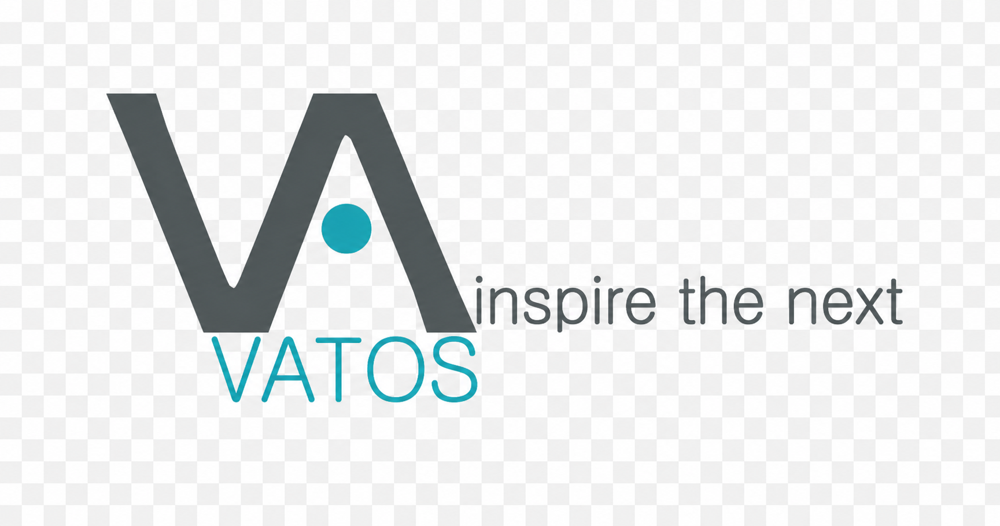

---
design_system:
  name: "VATOS Design System"
  version: "alpha"
  revision: "2026.07.14"
  last_updated: "2026.07.14"
  language: "ko-KR"
  description: "VATOS의 문서, 발표자료, 보고서, 웹 콘텐츠, 데이터 표, 시각화 자료에 공통 적용되는 디자인 기준"
  structure:
    - "README.md"
    - "DESIGN.md"
    - "skill.md"
    - "assets/logos/"
    - "assets/theme/"
    - "specs/ppt-base.md"
    - "specs/word-base.md"
    - "specs/theme/document-theme-guide.md"
    - "references/"
    - "examples/"
  tone:
    - "Refined"
    - "Urban"
    - "Professional"
    - "Technical"
    - "Trustworthy"

source_priority:
  - "사용자가 제공한 원문 내용과 명시 요청"
  - "산출물 유형별 규격 파일: specs/ppt-base.md, specs/word-base.md"
  - "문서 작성 기본 테마: specs/theme/document-theme-guide.md"
  - "루트 DESIGN.md"
  - "assets/logos/에 보관된 VATOS 공식 로고 자산"
  - "assets/theme/에 보관된 VATOS 문서 테마 참고 이미지"
  - "사용자가 제공한 이미지, 아이콘, 템플릿 자산"
  - "references/에 보관된 레이아웃 참고 자료"
  - "examples/에 보관된 예시 산출물"
  - "README.md에 정의된 사용 방법과 운영 기준"
  - "문서 유형별 목적과 독자"

default_document_theme:
  guide: "specs/theme/document-theme-guide.md"
  name: "Urban Navy"
  reference: "assets/theme/Theme-Urban-Navy.png"

colors:
  dark:
    dark-navy:
      name: "Urban Navy"
      value: "#192C4F"
      role: "VATOS 주요 브랜드 다크 배경"
      usage:
        - "표지"
        - "섹션 구분"
        - "브랜드 강조 영역"
        - "다크 테마 기본 배경"
    dark-premium:
      name: "Premium Dark"
      value: "#07141F"
      role: "깊이감 보조 다크 톤"
      usage:
        - "사선 레이어"
        - "오버레이"
        - "히어로 내부 패널"
        - "핵심 메시지 박스"
        - "Closing 깊이감 표현"

  accent:
    accent-cyan:
      name: "Vatos Cyan"
      value: "#23A5B3"
      role: "주요 브랜드 강조"
      usage:
        - "핵심 수치"
        - "아이콘"
        - "CTA"
        - "선택 강조"
        - "작은 점 또는 라벨"
      restrictions:
        - "성공 또는 개선 의미로 사용하지 않는다"
        - "넓은 배경 면적으로 사용하지 않는다"
        - "본문 전체 텍스트 색상으로 사용하지 않는다"
    accent-teal:
      name: "Deep Teal"
      value: "#0F4B51"
      role: "차분한 기술 강조"
      usage:
        - "데이터 섹션"
        - "분석 헤더"
        - "절제된 강조"

  text:
    text-graphite:
      name: "Graphite"
      value: "#3D4345"
      role: "강한 중립 색상"
      usage:
        - "섹션 라벨"
        - "표 헤더"
        - "강조 구분선"
    text-charcoal:
      name: "Vatos Charcoal"
      value: "#4E5658"
      role: "기본 텍스트 색상"
      usage:
        - "제목"
        - "본문"
        - "브랜드 기본 텍스트"
    text-inverse:
      name: "White"
      value: "#FFFFFF"
      role: "어두운 배경 위 텍스트"
      usage:
        - "다크 배경 제목"
        - "다크 배경 본문"
        - "로고 대비 영역"

  surface:
    surface-white:
      name: "White"
      value: "#FFFFFF"
      role: "기본 표면"
      usage:
        - "카드"
        - "표 본문"
        - "기본 배경"
    surface-bg:
      name: "Cloud White"
      value: "#F7F9FA"
      role: "밝은 배경"
      usage:
        - "본문 페이지"
        - "보고서 배경"
        - "카드 섹션"
    surface-soft:
      name: "Soft Gray"
      value: "#E8EEF0"
      role: "보더 및 연한 표면"
      usage:
        - "표 보더"
        - "카드 구분선"
        - "연한 박스 배경"
    border-subtle:
      name: "Soft Gray"
      value: "#E8EEF0"
      role: "기본 보더"
      usage:
        - "표 라인"
        - "카드 보더"
        - "구분선"

  supporting:
    restrictions:
      - "Supporting Colors는 브랜드 메인 컬러처럼 사용하지 않는다"
      - "Supporting Colors는 Vatos Cyan을 대체하지 않는다"
      - "Supporting Colors는 넓은 배경 면적에 사용하지 않는다"
      - "상태 의미가 명확한 경우 Semantic Colors를 우선 사용한다"
    support-coral:
      name: "Warm Coral"
      value: "#D88669"
      tint: "#F9D5C6"
      role: "따뜻한 보조 강조"
      usage:
        - "보조 CTA"
        - "중요 안내"
        - "시선 유도 포인트"
    support-sage:
      name: "Soft Sage"
      value: "#7EB396"
      tint: "#D2ECDD"
      role: "안정적이고 차분한 보조 강조"
      usage:
        - "안내 박스"
        - "그래프 보조 계열"
        - "차분한 보조 강조"
    support-amber:
      name: "Warm Amber"
      value: "#DFAE68"
      tint: "#F6E6CB"
      role: "온기 있는 주의 강조"
      usage:
        - "주의 안내"
        - "배지"
        - "보고서 강조 박스"

  semantic:
    semantic-success:
      name: "Success Green"
      value: "#2E7D32"
      role: "긍정, 개선, 정상"
    semantic-success-soft:
      name: "Success Soft"
      value: "#E8F5E9"
      role: "연한 성공 배경"
    semantic-danger:
      name: "Danger Red"
      value: "#C62828"
      role: "부정, 저하, 오류"
    semantic-danger-soft:
      name: "Danger Soft"
      value: "#FDECEC"
      role: "연한 위험 배경"
    semantic-warning:
      name: "Warning Amber"
      value: "#F59E0B"
      role: "주의, 검토 필요"
    semantic-warning-soft:
      name: "Warning Soft"
      value: "#FFF7E6"
      role: "연한 주의 배경"
    semantic-info:
      name: "Info Blue"
      value: "#2563EB"
      role: "정보, 참고"
    semantic-info-soft:
      name: "Info Soft"
      value: "#EFF6FF"
      role: "연한 정보 배경"
    semantic-neutral:
      name: "Neutral Gray"
      value: "#6F7A7D"
      role: "변화 없음, 중립"

typography:
  font_family:
    primary: "Pretendard"
    fallback:
      - "Noto Sans KR"
      - "Malgun Gothic"
      - "Arial"
      - "sans-serif"
  hierarchy:
    display:
      usage: "표지 제목, 히어로 제목, 대형 메시지"
      weight: "ExtraBold / Bold"
      ppt_size: "38~48pt"
      web_size: "44~56px"
      line_height: 1.1
    section_title:
      usage: "챕터 구분, 섹션 타이틀"
      weight: "Bold"
      ppt_size: "30~36pt"
      web_size: "32~40px"
      line_height: 1.15
    slide_title:
      usage: "슬라이드 제목, 페이지 핵심 메시지"
      weight: "Bold"
      ppt_size: "24~30pt"
      web_size: "28~34px"
      line_height: 1.2
    subtitle:
      usage: "부제목, 섹션 보조 설명"
      weight: "SemiBold / Bold"
      ppt_size: "17~20pt"
      web_size: "20~24px"
      line_height: 1.3
    body:
      usage: "본문, 설명, bullet"
      weight: "Regular / Medium"
      ppt_size: "13~16pt"
      web_size: "15~17px"
      line_height: "1.45~1.6"
    table_header:
      usage: "표 헤더"
      weight: "SemiBold / Bold"
      ppt_size: "11~13pt"
      web_size: "13~14px"
      line_height: 1.35
    table_body:
      usage: "표 본문 데이터"
      weight: "Regular"
      ppt_size: "9.5~11.5pt"
      web_size: "12~13px"
      line_height: "1.35~1.45"
    caption:
      usage: "주석, 출처, 조건, 보조 설명"
      weight: "Regular"
      ppt_size: "8.5~9.5pt"
      web_size: "11~12px"
      line_height: 1.4

spacing:
  base_unit: "8px"
  sub_unit: "4px"
  scale:
    space-4: "4px"
    space-8: "8px"
    space-12: "12px"
    space-16: "16px"
    space-24: "24px"
    space-32: "32px"
    space-48: "48px"
    space-64: "64px"

radius:
  radius-xs: "4px"
  radius-sm: "8px"
  radius-md: "12px"
  radius-lg: "16px"
  radius-xl: "20px"
  radius-full: "999px"

shadow:
  shadow-none: "none"
  shadow-xs: "0 2px 6px rgba(7, 20, 31, 0.04)"
  shadow-sm: "0 6px 16px rgba(7, 20, 31, 0.05)"
  shadow-md: "0 10px 26px rgba(7, 20, 31, 0.06)"
  shadow-lg: "0 18px 42px rgba(7, 20, 31, 0.10)"

themes:
  dark_theme:
    purpose: "브랜드 인상, 섹션 전환, 핵심 메시지 강조"
    main_colors:
      - "dark-navy"
      - "dark-premium"
      - "accent-cyan"
    usage:
      - "표지"
      - "섹션 구분"
      - "핵심 메시지"
      - "Closing"
  light_theme:
    purpose: "본문 가독성, 정보 정리, 데이터 전달"
    main_colors:
      - "surface-white"
      - "surface-bg"
      - "surface-soft"
      - "text-charcoal"
    usage:
      - "본문"
      - "표"
      - "목록"
      - "보고서"
      - "상세 설명"
  urban_navy_theme:
    purpose: "회사소개서, 제안서, 영업용 브랜드 문서"
    main_colors:
      - "dark-navy"
      - "dark-premium"
      - "accent-cyan"
      - "surface-white"
    usage:
      - "회사소개서"
      - "제안서"
      - "영업용 소개 자료"
      - "브랜드 장표"

components:
  cards:
    background: "surface-white 또는 surface-bg"
    border: "1px surface-soft"
    radius: "radius-md 또는 radius-lg"
    shadow: "shadow-none 또는 shadow-xs"
  buttons:
    primary:
      background: "accent-cyan"
      text: "text-inverse"
    secondary:
      background: "surface-white"
      text: "text-charcoal"
    dark:
      background: "dark-navy"
      text: "text-inverse"
  tables:
    header_alignment: "center"
    long_text_alignment: "left"
    short_category_alignment: "center"
    numeric_alignment: "right"
    border: "1px surface-soft"
  badges:
    brand: "accent-cyan"
    success: "semantic-success"
    danger: "semantic-danger"
    warning: "semantic-warning"
    info: "semantic-info"
    neutral: "semantic-neutral"

brand_assets:
  logo_directory: "assets/logos/"
  logos:
    primary_signature_slogan:
      path: "assets/logos/CI_VATOS_logo_signature_slogan.png"
      usage: "밝은 배경용 공식 시그니처"
    symbol_wordmark:
      path: "assets/logos/CI_VATOS_logo_symbol_wordmark.png"
      usage: "일반 문서, 본문 상단, 표지 보조 로고"
    wordmark_only:
      path: "assets/logos/CI_VATOS_wordmark_only.png"
      usage: "공간이 좁은 영역, 하단 푸터, 보조 브랜드 표기"
    symbol_only:
      path: "assets/logos/CI_VATOS_symbol_only.png"
      usage: "아이콘, 워터마크, 썸네일, 작은 브랜드 마크"
    dark_signature_slogan:
      path: "assets/logos/CI_VATOS_dark_signature_slogan.png"
      usage: "어두운 네이비 계열 표지, 섹션 구분, Closing 화면"
  rules:
    - "로고 색상, 비율, 형태를 임의로 변경하지 않는다"
    - "로고에 그림자, 테두리, 그라데이션, 효과를 추가하지 않는다"
    - "Markdown 문서에서는 로고 이미지를 직접 삽입하지 않고 상대 경로로 참조한다"
    - "AI가 VATOS 로고나 유사 로고를 새로 생성하지 않는다"

ai_rules:
  source_fidelity:
    - "원문에 없는 내용을 임의로 추가하지 않는다"
    - "고객사명, 프로젝트명, 수치, 일정, 금액, 계약명은 원문 기준으로 유지한다"
    - "자료에 없는 내용은 추가 확인 필요 또는 자료 미제공으로 표시한다"
  editable_output:
    - "텍스트, 표, 카드, 다이어그램은 가능한 한 편집 가능한 형태로 작성한다"
    - "로고, 사진, 스크린샷, 승인된 원본 이미지는 이미지로 사용할 수 있다"
    - "슬라이드 전체, 표, 카드, 텍스트 묶음을 통이미지로 삽입하지 않는다"
  design_tone:
    - "정제되고 도회적이며 전문적인 톤을 유지한다"
    - "화려한 장식보다 정보 구조와 가독성을 우선한다"
    - "캐주얼하거나 가벼운 스타트업 템플릿 느낌을 지양한다"

do_not:
  - "Vatos Cyan을 성공 또는 개선 의미로 사용하지 않는다"
  - "Supporting Colors를 브랜드 메인 컬러처럼 사용하지 않는다"
  - "Premium Dark를 검은색 메인 배경처럼 남용하지 않는다"
  - "순수 Black #000000을 기본 텍스트로 사용하지 않는다"
  - "로고를 임의로 변형하지 않는다"
  - "원문에 없는 내용을 임의로 추가하지 않는다"
---

# VATOS Design System

VATOS Design System은 VATOS의 문서, 발표자료, 보고서, 웹 콘텐츠, 데이터 표, 시각화 자료 등 다양한 산출물에 공통으로 적용되는 디자인 기준이다.

이 문서는 특정 산출물 형식에 한정되지 않으며, VATOS 브랜드 일관성, 정보 구조, 시각적 톤앤매너, 공통 디자인 토큰을 정의하는 기준서로 사용한다.

공식 로고 자산은 `assets/logos/` 하위에 별도로 보관하며, `DESIGN.md`에서는 로고 사용 기준과 파일 경로를 정의한다.

| 항목 | 내용 |
|---|---|
| 문서명 | VATOS Design System Guide |
| Version | alpha |
| Revision | 2026.07.14 |
| Last Updated | 2026.07.14 |
| 문서 목적 | VATOS 브랜드와 디자인 일관성을 유지하기 위한 공통 디자인 기준 정의 |
| 활용 범위 | 문서, 발표자료, 보고서, 웹 콘텐츠, 데이터 표, 시각화 자료 등 VATOS 브랜드 기준이 필요한 산출물 |

## Overview

VATOS Design System은 VATOS 산출물이 일관된 브랜드 인상과 정돈된 정보 구조를 유지하도록 돕는 공통 디자인 기준이다.

이 시스템은 색상, 타이포그래피, 레이아웃, 형태, 컴포넌트, 테마, 브랜드 자산 사용 기준을 정의한다.  
산출물별 세부 작성 방식은 본 문서의 공통 기준을 우선 적용하고, 사용자가 제공한 목적과 산출물 형식에 맞게 조정한다.

VATOS Design System의 목표는 모든 산출물이 정제되고, 도회적이며, 전문적이고, 기술적 신뢰감이 있으며, 명확한 브랜드 인상을 일관되게 유지하도록 하는 것이다.

## Repository Reference Structure

현재 VATOS Design System 저장소는 아래 구조를 기준으로 운영한다.

```text
vatos-design-system/
├─ README.md
├─ DESIGN.md
├─ skill.md
├─ assets/
│  ├─ logos/
│  └─ theme/
│     └─ Theme-Urban-Navy.png
├─ specs/
│  ├─ ppt-base.md
│  ├─ word-base.md
│  └─ theme/
│     └─ document-theme-guide.md
├─ references/
└─ examples/
```

| Path | Role |
|---|---|
| `README.md` | 디자인 시스템의 목적, 사용 방법, 운영 기준을 설명하는 안내 문서 |
| `DESIGN.md` | VATOS 공통 디자인 기준, 토큰, 컴포넌트, AI 작성 기준을 담은 핵심 기준서 |
| `skill.md` | AI 도구가 VATOS Design System을 적용할 때 참고하는 실행 지침 |
| `assets/logos/` | VATOS 공식 로고 이미지 보관 폴더 |
| `assets/theme/Theme-Urban-Navy.png` | 별도 요청이 없을 때 우선 적용할 문서 기본 테마 참고 이미지 |
| `specs/ppt-base.md` | PowerPoint 산출물 작성 시 우선 적용할 세부 규격 |
| `specs/word-base.md` | Word 또는 일반 문서 산출물 작성 시 우선 참고할 세부 규격 |
| `specs/theme/document-theme-guide.md` | Word, PPT, Excel, HTML, Markdown 문서에 공통 적용할 표지·내지·마무리 기본 테마 가이드 |
| `references/` | 레이아웃, 위치, 정렬감 등 디자인 참고 자료 보관 폴더 |
| `examples/` | PDF, HTML, Word, Excel 등 실제 예시 산출물 보관 폴더 |

## Document Theme Reference

문서 작성 시 별도 디자인 요청이 없는 경우, 표지·내지·마무리 페이지는 `specs/theme/document-theme-guide.md`의 기본 문서 테마를 우선 적용한다.

기본 테마 이미지는 `assets/theme/Theme-Urban-Navy.png`를 참고한다. 해당 이미지는 단순 미리보기가 아니라, VATOS 문서 작성 시 우선 적용할 Urban Navy 기반 표지·내지·마무리 톤앤매너 기준이다.

```text
Default Document Theme
→ Guide: specs/theme/document-theme-guide.md
→ Reference Image: assets/theme/Theme-Urban-Navy.png
```

## Colors

VATOS는 로고에서 파생된 **Charcoal Gray + Cyan Accent** 컬러 시스템을 사용한다.

컬러는 브랜드 정체성을 표현하고, 정보 위계를 구분하며, 핵심 메시지와 상태 정보를 명확하게 전달하기 위해 사용한다.  
색상은 장식 목적이 아니라 정보 구조, 가독성, 강조, 상태 구분을 돕는 기준으로 사용한다.

### Color Roles

VATOS 컬러는 역할에 따라 아래와 같이 구분한다.

| Group | Purpose |
|---|---|
| Brand / Accent | 브랜드 포인트, 핵심 강조, 아이콘, CTA |
| Dark / Navy | 표지, 섹션 구분, 브랜드 다크 배경, 깊이감 표현 |
| Charcoal / Text | 제목, 본문, 표 라벨, 구분선 |
| Surface / Background | 본문 배경, 카드, 표, 보더 |
| Supporting Colors | 보조 CTA, 안내 박스, 보조 강조, 시각적 단조로움 완화 |
| Semantic Colors | 개선, 저하, 경고, 정보 등 상태 의미 |

### Brand / Accent Colors

Brand / Accent 색상은 VATOS 정체성과 중요한 시각 강조를 표현할 때 사용한다.  
브랜드 포인트의 의미가 흐려지지 않도록 제한적으로 사용한다.

| Token | Name | HEX | Role | Usage |
|---|---|---:|---|---|
| `accent-cyan` | Vatos Cyan | `#23A5B3` | 주요 브랜드 강조 | 핵심 수치, 아이콘, CTA, 선택 강조, 작은 점/라벨 |
| `accent-teal` | Deep Teal | `#0F4B51` | 차분한 기술 강조 | 데이터 섹션, 분석 헤더, 절제된 강조 |

#### Usage Rules

- Vatos Cyan은 주요 브랜드 포인트로 사용한다.
- 한 화면에서 Cyan 강조는 1~3개 영역으로 제한한다.
- Cyan은 브랜드 강조용으로 사용하며, 성공 또는 개선 의미로 사용하지 않는다.
- Cyan을 본문 전체 텍스트 색상으로 사용하지 않는다.
- 더 차분하고 기술적인 강조가 필요할 때 Deep Teal을 사용한다.

### Dark / Navy Colors

Dark / Navy 색상은 VATOS의 도회적이고 안정적인 브랜드 인상을 만든다.  
Urban Navy는 표지, 섹션 구분, 브랜드 강조 영역의 주 배경으로 사용한다.  
Premium Dark는 단독 메인 배경이 아니라, Urban Navy 배경 위에서 사선 레이어, 오버레이, 내부 패널, 그림자 영역처럼 깊이감과 명암을 만드는 보조 다크 컬러로 사용한다.

| Token | Name | HEX | Role | Usage |
|---|---|---:|---|---|
| `dark-navy` | Urban Navy | `#192C4F` | 주요 브랜드 다크 배경 | 표지, 섹션 구분, 브랜드 강조 영역, 다크 테마 기본 배경 |
| `dark-premium` | Premium Dark | `#07141F` | 깊이감 보조 다크 톤 | 사선 레이어, 오버레이, 히어로 내부 패널, 핵심 메시지 박스, Closing의 깊이감 표현 |

#### Usage Rules

- Urban Navy는 VATOS의 메인 네이비 배경으로 사용한다.
- Premium Dark는 검은색 메인 컬러처럼 사용하지 않는다.
- Premium Dark는 Urban Navy 위에 얹는 깊이감, 레이어, 오버레이 용도로 제한적으로 사용한다.
- 어두운 배경에서는 전용 로고를 사용한다.
- 어두운 배경에서는 White 또는 Cloud White 계열 텍스트를 사용한다.
- 어두운 배경에서 Cyan은 제한적인 포인트로만 사용한다.
- 긴 표, 정보량이 많은 페이지, 긴 본문에는 다크 배경을 사용하지 않는다.

### Charcoal / Text Colors

Charcoal / Text 색상은 VATOS 문서의 기본 읽기 톤을 형성한다.

| Token | Name | HEX | Role | Usage |
|---|---|---:|---|---|
| `text-graphite` | Graphite | `#3D4345` | 강한 중립 색상 | 섹션 라벨, 표 헤더, 강조 구분선 |
| `text-charcoal` | Vatos Charcoal | `#4E5658` | 기본 텍스트 색상 | 제목, 본문, 브랜드 기본 색상 |

#### Usage Rules

- 본문과 제목의 기본 색상은 Vatos Charcoal을 사용한다.
- 더 강한 위계가 필요할 때 Graphite를 사용한다.
- 접근성 또는 시스템 제약이 있는 경우를 제외하고 순수 Black 사용은 피한다.
- Cyan 또는 Navy를 기본 본문 텍스트 색상으로 사용하지 않는다.

### Surface / Background Colors

Surface 색상은 시각적으로 무겁지 않게 구조를 만든다.

| Token | Name | HEX | Role | Usage |
|---|---|---:|---|---|
| `surface-white` | White | `#FFFFFF` | 기본 표면 | 카드, 표 본문, 기본 배경 |
| `surface-soft` | Soft Gray | `#E8EEF0` | 보더 및 연한 표면 | 표 보더, 카드 구분선, 연한 박스 배경 |
| `surface-bg` | Cloud White | `#F7F9FA` | 밝은 배경 | 본문 페이지, 보고서 배경, 카드 섹션 |

#### Usage Rules

- 기본 본문 배경은 Cloud White 또는 White를 사용한다.
- 보더, 라인, 구분선, 연한 Surface에는 Soft Gray를 사용한다.
- 배경색은 장식이 아니라 가독성 보조를 위해 사용한다.
- 본문 페이지는 밝고 정돈된 상태를 유지한다.

### Recommended Supporting Colors

Recommended Supporting Colors는 VATOS 기본 팔레트만으로 화면이나 문서가 단조로워질 때 제한적으로 사용할 수 있는 보조 컬러이다.

이 색상은 VATOS의 공식 브랜드 컬러가 아니며, Vatos Cyan을 대체하지 않는다.  
보고서, 홈페이지 섹션, 배지, 보조 CTA, 안내 박스, 강조 카드처럼 작은 면적에서만 사용한다.

| Token | Name | HEX | Tint | Role | Usage |
|---|---|---:|---:|---|---|
| `support-coral` | Warm Coral | `#D88669` | `#F9D5C6` | 따뜻한 보조 강조 | 보조 CTA, 중요 안내, 시선 유도 포인트 |
| `support-sage` | Soft Sage | `#7EB396` | `#D2ECDD` | 안정적이고 차분한 보조 강조 | 안내 박스, 그래프 보조 계열, 차분한 보조 강조 |
| `support-amber` | Warm Amber | `#DFAE68` | `#F6E6CB` | 온기 있는 주의 강조 | 주의 안내, 배지, 보고서 강조 박스 |

#### Usage Rules

- Supporting Colors는 브랜드 메인 컬러가 아니라 보조 팔레트로 사용한다.
- Supporting Colors는 Vatos Cyan을 대체하는 Primary Color로 사용하지 않는다.
- Supporting Colors는 넓은 배경 면적에 사용하지 않고, 카드 헤더, 배지, 작은 CTA, 안내 박스처럼 제한된 영역에 사용한다.
- 상태 의미가 명확한 경우에는 Supporting Colors보다 Semantic Colors를 우선 사용한다.
- 한 화면에서 Supporting Colors를 여러 개 동시에 사용하지 않는다.
- 공식 제안서나 고객 제출용 문서에서는 과하게 캐주얼해 보이지 않도록 사용량을 제한한다.
- Supporting Colors를 사용할 때도 텍스트 가독성과 배경 대비를 반드시 확인한다.

### Value Scale

아래 스케일은 색상의 명도와 대비를 판단할 때 사용한다.

| Order | Color | HEX | Usage |
|---:|---|---:|---|
| 1 | Premium Dark | `#07141F` | 가장 깊은 배경, 오버레이, 깊이감 보조 |
| 2 | Urban Navy | `#192C4F` | 메인 브랜드 다크 배경 |
| 3 | Deep Teal | `#0F4B51` | 어두운 보조 강조 |
| 4 | Graphite | `#3D4345` | 강한 텍스트 / 구분선 |
| 5 | Vatos Charcoal | `#4E5658` | 주요 제목 / 본문 |
| 6 | Vatos Cyan | `#23A5B3` | 밝은 브랜드 강조 |
| 7 | Warm Coral | `#D88669` | 따뜻한 보조 강조 |
| 8 | Soft Sage | `#7EB396` | 차분한 보조 강조 |
| 9 | Warm Amber | `#DFAE68` | 온기 있는 보조 강조 |
| 10 | Soft Gray | `#E8EEF0` | 보더 / 연한 표면 |
| 11 | Cloud White | `#F7F9FA` | 밝은 배경 |
| 12 | White | `#FFFFFF` | 기본 표면 / 카드 / 표 본문 |

### Recommended Color Combinations

#### Cover / Section Divider

| Role | Color |
|---|---|
| Main Background | Urban Navy `#192C4F` |
| Depth / Overlay | Premium Dark `#07141F` |
| Accent | Vatos Cyan `#23A5B3` |
| Text | White / Cloud White |

권장 활용 예시:

- 제안서 표지
- 회사소개서 표지
- 섹션 구분
- 핵심 메시지 페이지

#### Report / Body Content

| Role | Color |
|---|---|
| Background | Cloud White `#F7F9FA` 또는 White `#FFFFFF` |
| Text | Vatos Charcoal `#4E5658` |
| Strong Text | Graphite `#3D4345` |
| Border | Soft Gray `#E8EEF0` |
| Accent | Vatos Cyan `#23A5B3` |

권장 활용 예시:

- SQL 튜닝 보고서
- 프로젝트 현황 보고서
- 회의자료
- 표 중심의 기술 문서

#### Web / Report Supporting Accent

| Role | Color |
|---|---|
| Primary Accent | Vatos Cyan `#23A5B3` |
| Supporting CTA | Warm Coral `#D88669` |
| Soft Success-like Accent | Soft Sage `#7EB396` |
| Warm Notice Accent | Warm Amber `#DFAE68` |
| Supporting Tint Background | Coral Tint `#F9D5C6`, Sage Tint `#D2ECDD`, Amber Tint `#F6E6CB` |

권장 활용 예시:

- 홈페이지 보조 CTA
- 보고서 내 보조 강조 카드
- 안내 박스
- 배지 또는 태그
- 그래프 보조 계열

### Semantic Colors

Brand Color와 Semantic Color는 반드시 구분해서 사용한다.

VATOS Brand Color는 회사 정체성과 문서 구조를 만드는 데 사용한다.  
Semantic Color는 개선, 저하, 경고, 정보, 중립 상태처럼 의미를 전달할 때 사용한다.

| Token | Name | HEX | Meaning | Usage |
|---|---|---:|---|---|
| `semantic-success` | Success Green | `#2E7D32` | 긍정, 개선, 정상 | 성능 개선, 완료, 정상 상태 |
| `semantic-success-soft` | Success Soft | `#E8F5E9` | 연한 성공 배경 | Success badge/card |
| `semantic-danger` | Danger Red | `#C62828` | 부정, 저하, 오류 | 성능 저하, 실패, 위험 |
| `semantic-danger-soft` | Danger Soft | `#FDECEC` | 연한 위험 배경 | Risk badge/card |
| `semantic-warning` | Warning Amber | `#F59E0B` | 주의, 검토 필요 | 영향도 검토, 보류, 주의 |
| `semantic-warning-soft` | Warning Soft | `#FFF7E6` | 연한 주의 배경 | Warning badge/card |
| `semantic-info` | Info Blue | `#2563EB` | 정보, 참고 | 안내, 참고, 가이드 |
| `semantic-info-soft` | Info Soft | `#EFF6FF` | 연한 정보 배경 | Info box |
| `semantic-neutral` | Neutral Gray | `#6F7A7D` | 변화 없음, 중립 | 변경 없음, 현상 유지 |

### Emphasis & Status Color Rules

색상은 단순 장식이 아니라 정보의 중요도와 상태를 구분하기 위해 사용한다.  
Vatos Cyan은 브랜드 포인트와 핵심 강조에 사용하고, 성공·위험·주의·정보와 같은 상태 표현에는 Semantic Color를 사용한다.

| 목적 | 의미 | 사용 색상 |
|---|---|---|
| 핵심 강조 | 중요한 키워드, 핵심 수치, 선택된 항목 | Vatos Cyan |
| 보조 강조 | 보조 CTA, 안내 박스, 보조 카드 강조 | Warm Coral, Soft Sage, Warm Amber |
| 긍정 / 완료 | 성공, 개선, 완료, 정상 | Success Green |
| 부정 / 위험 | 오류, 실패, 저하, 리스크 | Danger Red |
| 주의 / 검토 필요 | 확인 필요, 보류, 영향도 검토 | Warning Amber |
| 참고 / 안내 | 참고 정보, 가이드, 보조 설명 | Info Blue |
| 중립 / 변화 없음 | 유지, 해당 없음, 일반 상태 | Neutral Gray |

#### Usage Rules

- 색상은 한 화면에서 1~3개 정도만 제한적으로 사용한다.
- Vatos Cyan은 브랜드 강조용이며, 성공 또는 개선 의미로 사용하지 않는다.
- Warm Coral, Soft Sage, Warm Amber는 보조 강조용이며, 브랜드 메인 컬러처럼 사용하지 않는다.
- 상태를 표현할 때는 색상만 사용하지 말고 반드시 텍스트 라벨을 함께 표시한다.
- 본문 전체를 강조 색상으로 작성하지 않는다.
- 중요한 수치나 키워드는 Bold, 크기, 여백, 배치와 함께 강조한다.

## Typography

VATOS Typography는 정보의 위계와 가독성을 명확하게 만들기 위한 기준이다.  
서체는 산출물의 분위기를 결정하는 핵심 요소이므로, 하나의 문서 안에서 일관된 서체와 계층 구조를 유지한다.

### Font Family

VATOS 문서의 기본 서체는 **Pretendard**를 사용한다.  
Pretendard 사용이 어려운 환경에서는 아래 대체 서체 순서를 따른다.

기본 서체:

```css
font-family: "Pretendard";
```

대체 서체 스택:

```css
font-family: "Pretendard", "Noto Sans KR", "Malgun Gothic", Arial, sans-serif;
```

| Priority | Font | Usage |
|---:|---|---|
| 1 | Pretendard | 기본 제작 서체 |
| 2 | Noto Sans KR | 웹/문서 대체 서체 |
| 3 | Malgun Gothic | Windows/Office 호환 서체 |
| 4 | Arial | 영문 대체 서체 |
| 5 | sans-serif | 시스템 대체 서체 |

### Typography Hierarchy

Typography Hierarchy는 제목, 본문, 표, 캡션의 위계를 일관되게 유지하기 위한 기준이다.  
PPT와 Web은 매체 특성이 다르므로 크기 기준을 분리해 적용한다.

| Level | Usage | Weight | PPT Size | Web Size | Line Height |
|---|---|---:|---:|---:|---:|
| Display | 표지 제목, 히어로 제목, 대형 메시지 | ExtraBold / Bold | 38~48pt | 44~56px | 1.1 |
| Section Title | 챕터 구분, 섹션 타이틀 | Bold | 30~36pt | 32~40px | 1.15 |
| Slide Title | 슬라이드 제목, 페이지 핵심 메시지 | Bold | 24~30pt | 28~34px | 1.2 |
| Sub Title | 부제목, 섹션 보조 설명 | SemiBold / Bold | 17~20pt | 20~24px | 1.3 |
| Body | 본문, 설명, bullet | Regular / Medium | 13~16pt | 15~17px | 1.45~1.6 |
| Table Header | 표 헤더 | SemiBold / Bold | 11~13pt | 13~14px | 1.35 |
| Table Body | 표 본문 데이터 | Regular | 9.5~11.5pt | 12~13px | 1.35~1.45 |
| Caption | 주석, 출처, 조건, 보조 설명 | Regular | 8.5~9.5pt | 11~12px | 1.4 |

### Usage Rules

- Pretendard를 기본 서체로 사용한다.
- 하나의 산출물 안에서 여러 서체를 섞어 사용하지 않는다.
- 제목은 단순 라벨이 아니라 페이지의 핵심 메시지가 드러나도록 작성한다.
- 본문은 긴 문단보다 간결한 bullet 구성을 우선한다.
- 내용을 한 페이지에 억지로 넣기 위해 글자 크기를 과도하게 줄이지 않는다.
- 정보량이 많으면 여러 페이지, 슬라이드 또는 섹션으로 분리한다.
- Bold는 핵심 키워드와 수치 강조에 제한적으로 사용하며, 색상 강조는 Colors 기준을 따른다.
- 표 본문 크기는 가독성을 해치지 않는 범위에서만 조정한다.
- 외부 전달용 문서는 글꼴 호환성을 고려해 PDF 내보내기를 사용한다.

## Layout

VATOS Layout은 정보를 보기 좋게 배치하는 것이 아니라, 핵심 메시지를 빠르게 이해하도록 구조화하는 기준이다.  
각 페이지, 슬라이드, 섹션은 하나의 중심 메시지를 기준으로 구성하며, 여백과 정렬은 정보 위계를 만드는 도구로 사용한다.

### Layout Philosophy

> One Message, Clear Structure.

각 페이지 또는 슬라이드는 하나의 핵심 메시지를 가져야 한다.  
정보를 많이 넣는 것보다, 의사결정자가 빠르게 이해할 수 있도록 메시지와 구조를 명확히 만드는 것을 우선한다.

#### Core Principles

| Principle | Meaning |
|---|---|
| One Message | 한 페이지 또는 슬라이드에는 하나의 핵심 메시지를 중심으로 구성한다 |
| Clear Structure | 제목, 요약, 본문, 시각 요소의 역할을 명확히 구분한다 |
| Readable Density | 정보량은 유지하되, 가독성을 해치지 않는 밀도를 유지한다 |
| Consistent Alignment | 정렬 기준을 일관되게 유지해 문서 전체의 완성도를 높인다 |
| Flexible Composition | 산출물 형식과 화면 크기에 따라 컬럼, 카드, 표 구성을 유연하게 조정한다 |

### Information Flow

정보는 일반적으로 아래 순서로 배치한다.

1. 제목
2. 요약 또는 핵심 메시지
3. 주요 시각 요소: 카드, 표, 차트, 비교 구조
4. 상세 설명
5. 캡션, 출처, 조건, 기준 정보

#### Usage Rules

- 제목은 페이지의 내용을 단순히 설명하는 라벨이 아니라 핵심 메시지가 드러나도록 작성한다.
- 요약 정보는 본문보다 먼저 배치해 전체 맥락을 빠르게 파악할 수 있게 한다.
- 표, 차트, 카드, 다이어그램은 본문을 대체하는 장식 요소가 아니라 이해를 돕는 정보 구조로 사용한다.
- 출처, 기준일, 단위, 조건은 필요한 경우 하단 또는 캡션 영역에 명확히 표시한다.

### Spacing System

VATOS Layout은 8px 기반 spacing system을 사용한다.  
작은 보정이 필요한 경우 4px 단위를 함께 사용할 수 있다.

| Token | Size | Usage |
|---|---:|---|
| `space-4` | 4px | 아이콘과 텍스트 간격, 미세 조정 |
| `space-8` | 8px | 라벨과 값 사이 간격, 작은 요소 간격 |
| `space-12` | 12px | 작은 내부 여백, 작은 카드 요소 간격 |
| `space-16` | 16px | 기본 요소 간격, 작은 카드 padding |
| `space-24` | 24px | 카드 내부 여백, 일반 블록 간격 |
| `space-32` | 32px | 주요 블록 간격, 섹션 내부 구분 |
| `space-48` | 48px | 페이지/슬라이드 내 큰 구획 간격 |
| `space-64` | 64px | HTML 큰 섹션 간격, 넓은 화면의 섹션 간격 |

#### Usage Rules

- 여백은 장식이 아니라 정보의 묶음과 분리를 표현하는 수단으로 사용한다.
- 관련 정보는 가깝게, 다른 정보 그룹은 충분히 떨어뜨려 배치한다.
- 카드 내부 여백은 일반적으로 `space-24`를 기준으로 한다.
- 섹션 간 간격은 `space-32` 이상을 권장한다.
- 한 페이지에 내용을 억지로 넣기 위해 여백을 과도하게 줄이지 않는다.

### Grid & Container

Grid와 Container는 산출물의 형식에 따라 다르게 적용한다.  
공통 기준은 정보의 정렬, 반복 구조, 시각적 안정감을 유지하는 것이다.

| Target | Rule |
|---|---|
| PPT | 1~4열 구성을 사용하며, 4열을 초과하는 구성은 지양한다 |
| HTML | 12-column grid를 기준으로 구성한다 |
| Report / PDF | 본문 폭을 과도하게 넓히지 않고 읽기 좋은 폭을 유지한다 |
| Word Document | 제목, 본문, 표, 캡션의 정렬 기준을 일관되게 유지한다 |
| Mobile HTML | 좁은 화면에서는 1열 스택 구성을 우선한다 |
| Data-heavy Content | 표, 카드, 차트, 긴 본문을 한 화면에 과도하게 혼합하지 않는다 |

#### PPT Composition

| Layout | Usage |
|---|---|
| 1 Column | 핵심 메시지, 요약, 결론 |
| 2 Columns | AS-IS / TO-BE, 비교, 전후 변화 |
| 3 Columns | 단계, 서비스 영역, 핵심 기능 |
| 4 Columns | 짧은 지표 카드, 간단한 분류 |
| 5 Columns 이상 | 가독성이 떨어지므로 사용을 지양한다 |

#### HTML Composition

| Layout | Usage |
|---|---|
| 12-column grid | 웹 페이지 기본 구조 |
| 2-column layout | 설명 + 시각 요소, 본문 + 사이드 정보 |
| 3-column card grid | 서비스, 기능, 요약 카드 |
| Single column | 모바일, 긴 본문, 집중형 콘텐츠 |
| Horizontal scroll | 모바일에서 넓은 표나 카테고리 목록이 필요한 경우 |

### Whitespace Philosophy

Whitespace는 빈 공간이 아니라 정보 구조를 만드는 요소이다.  
VATOS 문서는 여백을 통해 전문성, 정돈감, 가독성을 만든다.

| Principle | Meaning |
|---|---|
| Technical Clarity Spacing | 정보를 더 많이 넣기보다 핵심 메시지와 데이터가 빠르게 읽히도록 여백을 사용한다 |
| Scan-friendly Density | 제목, 핵심 수치, 상태, 리스크를 빠르게 훑어볼 수 있도록 정보 밀도를 조절한다 |
| Card-format Composition | 카드, 표, 지표, 설명 블록을 조합해 정보를 구조화한다 |
| No Forced Fitting | 한 페이지에 억지로 많은 내용을 넣기 위해 여백과 글자 크기를 희생하지 않는다 |

#### Usage Rules

- 핵심 메시지 주변에는 충분한 여백을 둔다.
- 카드, 표, 차트가 서로 붙어 보이지 않도록 블록 간 간격을 유지한다.
- 정보량이 많은 페이지는 하나의 화면에 모두 넣기보다 섹션 또는 페이지를 분리한다.
- 여백이 부족해 보이면 글자 크기를 줄이기보다 구성 단위를 나눈다.
- 문서가 비어 보이지 않게 하되, 빽빽하게 채우는 방식은 지양한다.

### Responsive Principle

반응형 동작은 단순 축소가 아니라 재배치이다.  
화면이 좁아질수록 컬럼 수를 줄이고, 정보 구조를 다시 정렬해 가독성을 유지한다.

#### Usage Rules

- 다열 구성은 화면이 좁아질 때 2열 또는 1열로 전환한다.
- 넓은 표는 모바일에서 가로 스크롤 또는 카드 목록으로 전환할 수 있다.
- 내비게이션은 좁은 화면에서 compact menu로 축소할 수 있다.
- 버튼과 입력 요소는 터치 가능한 크기를 유지한다.
- 이미지는 원본 비율을 유지한다.
- 모바일에서 본문 텍스트를 과도하게 작게 만들지 않는다.

### Layout Rules

- 정보량이 많으면 페이지, 슬라이드 또는 섹션을 분리한다.
- 텍스트를 과도하게 줄여 한 페이지에 억지로 맞추지 않는다.
- 표, 그래프, 긴 본문, 많은 카드를 한 페이지에 모두 넣지 않는다.
- 정렬 기준을 일관되게 유지한다.
- 같은 성격의 요소는 같은 크기와 간격을 유지한다.
- 핵심 메시지, 수치, 상태 정보는 시각적으로 쉽게 찾을 수 있어야 한다.
- 산출물별 세부 여백, 안전 영역, 반응형 기준은 본 문서의 공통 기준을 바탕으로 산출물 형식에 맞게 조정한다.

## Elevation & Depth

VATOS의 깊이감은 강한 그림자 효과가 아니라, Surface 단계, 얇은 보더, 배경 명도 차이, 여백, 제한적인 오버레이를 통해 표현한다.  
그림자는 정보 구조를 분리하기 위한 보조 수단이며, 장식적인 입체 효과로 사용하지 않는다.

### Core Principle

VATOS는 그림자보다 보더와 절제된 배경 차이를 우선 사용한다.  
깊이감이 필요한 경우에도 강한 shadow보다 Surface 단계, 얇은 보더, 배경 명도 차이, 레이어 분리를 먼저 검토한다.

### Surface Hierarchy

| Level | Name | Treatment | Usage |
|---:|---|---|---|
| 0 | Flat Surface | No shadow | 페이지 배경, 기본 본문 영역 |
| 1 | Bordered Surface | 1px Soft Gray border, no shadow | 표, 기본 카드, 본문 컨테이너 |
| 2 | Raised Surface | Low shadow, 1px Soft Gray border | 요약 카드, 지표 카드, 강조 정보 블록 |
| 3 | Floating Surface | Medium shadow, White surface | 드롭다운, 팝오버, 떠 있는 보조 패널 |
| 4 | Overlay Surface | Dark overlay or strong separation | 모달, 전체 오버레이, 핵심 메시지 패널 |

### Shadow Tokens

아래 값은 그림자 표현을 일관되게 사용하기 위한 CSS 예시 토큰이다.

```css
:root {
  --shadow-none: none;
  --shadow-xs: 0 2px 6px rgba(7, 20, 31, 0.04);
  --shadow-sm: 0 6px 16px rgba(7, 20, 31, 0.05);
  --shadow-md: 0 10px 26px rgba(7, 20, 31, 0.06);
  --shadow-lg: 0 18px 42px rgba(7, 20, 31, 0.10);
}
```

### Usage Rules

- PPT에서는 대부분 그림자를 사용하지 않는다.
- 표에는 강한 그림자를 사용하지 않는다.
- 카드에는 보더와 배경 차이를 우선 적용하고, 필요한 경우에만 낮은 그림자를 사용한다.
- `shadow-xs`와 `shadow-sm`은 카드, 요약 박스, 지표 블록에 제한적으로 사용할 수 있다.
- `shadow-md`는 드롭다운, 팝오버, 떠 있는 보조 패널처럼 레이어 구분이 필요한 경우에 사용한다.
- `shadow-lg`는 웹 모달, 전체 오버레이, 중요한 플로팅 UI에만 사용한다.
- 여러 카드에 강한 그림자를 동시에 적용하지 않는다.
- 깊이감이 필요한 경우 그림자보다 배경 단계, 보더, 여백, 레이어 분리를 우선 사용한다.
- Premium Dark는 그림자 색상처럼 남용하지 않고, Urban Navy 위에서 깊이감이 필요한 오버레이나 패널에 제한적으로 사용한다.

## Shapes

VATOS Shapes는 카드, 버튼, 입력 요소, 배지, 컨테이너의 형태를 일관되게 유지하기 위한 기준이다.  
형태는 산출물의 인상을 결정하므로, 과하게 둥글거나 장식적인 형태보다 정돈되고 전문적인 형태를 우선한다.

### Shape Principle

VATOS는 부드럽지만 가볍지 않은 형태를 사용한다.  
둥근 모서리는 정보 블록을 구분하고 사용성을 높이기 위한 보조 요소이며, 캐주얼한 앱 UI처럼 보일 정도로 과도하게 사용하지 않는다.

### Radius Tokens

| Token | Size | Usage |
|---|---:|---|
| `radius-xs` | 4px | 작은 라벨, 미세한 표면 구분 |
| `radius-sm` | 8px | 태그, 작은 박스, 보조 버튼 |
| `radius-md` | 12px | 버튼, 입력 요소, 기본 카드 |
| `radius-lg` | 16px | 카드, Notice Box, 주요 정보 블록 |
| `radius-xl` | 20px | 큰 컨테이너, 히어로 카드, 강조 섹션 |
| `radius-full` | 999px | 배지, pill 요소, 필터 칩 |

### Usage Rules

- 라운드는 부드러운 인상을 주기 위한 보조 요소로 사용한다.
- 과도하게 둥근 카드나 버튼은 캐주얼한 앱 UI처럼 보일 수 있으므로 지양한다.
- 카드와 컨테이너는 일반적으로 `radius-md` 또는 `radius-lg`를 사용한다.
- 버튼과 입력 요소는 `radius-md`를 기본으로 사용한다.
- 작은 태그와 보조 박스는 `radius-sm`을 사용한다.
- Pill 형태는 배지, 태그, 필터처럼 짧은 라벨에만 사용한다.
- 표, 긴 본문 영역, 데이터 중심 컴포넌트에는 과한 라운드를 적용하지 않는다.
- 같은 행이나 같은 그룹에 있는 요소는 동일한 radius 기준을 적용한다.

## Components

VATOS Components는 문서, 발표자료, 보고서, 웹 콘텐츠에서 반복적으로 사용되는 정보 단위의 기준이다.  
컴포넌트는 장식이 아니라 정보 구조를 명확하게 만들기 위한 요소로 사용한다.

### Component Overview

VATOS에서 주로 사용하는 공통 컴포넌트는 다음과 같다.

| Component | Usage |
|---|---|
| Cards | 하나의 주제, 수치, 메시지, 요약 정보를 독립된 정보 단위로 표현 |
| Buttons | HTML, 웹 콘텐츠, 인터랙션 영역의 주요 행동 요소 |
| Tables | 데이터, 비교, 목록, 상세 정보를 구조적으로 표현 |
| Badges / Tags | 상태, 분류, 유형, 라벨을 짧게 표시 |
| Notice Boxes | 안내, 주의, 참고, 검토 필요 정보를 분리해 표시 |
| Metric Blocks | 핵심 수치, 성과 지표, 변화량을 강조 |
| Navigation | HTML 문서 또는 웹 페이지의 이동 구조 |
| Input Fields | 검색, 필터, 입력이 필요한 웹 UI 요소 |

컴포넌트 명칭은 식별을 위해 영문을 유지하며, 실제 사용 규칙은 각 항목별 설명을 따른다.

### Cards

카드는 하나의 주제, 수치, 메시지 또는 요약 정보를 독립된 정보 단위로 보여줄 때 사용한다.  
산출물 유형에 따라 아이콘, 라인, 컬러 블록, 수치 강조, 상태 배지, 미니 차트 등 보조 시각 요소를 포함할 수 있으나, 장식 요소는 정보 이해를 돕는 범위에서만 사용한다.

| Property | Value |
|---|---|
| Background | White 또는 Cloud White |
| Border | 1px Soft Gray |
| Radius | 12~16px |
| Shadow | 없음 ~ 낮음 |
| Padding | 20~28px |
| Title Color | Graphite |
| Body Color | Vatos Charcoal |
| Accent | 작은 Cyan 라인, 점, 라벨만 사용 |

#### Card Principles

| Rule | Description |
|---|---|
| One Topic | 하나의 카드에는 하나의 주제만 담는다 |
| Clear Hierarchy | 제목, 핵심 값, 설명, 보조 정보의 위계를 명확히 한다 |
| Editable First | 텍스트, 수치, 도형은 가능한 한 편집 가능한 형태로 구성한다 |
| Consistent Spacing | 카드 내부 여백과 카드 간 간격을 일관되게 유지한다 |
| Restrained Decoration | 장식 요소는 정보 이해를 돕는 수준으로만 사용한다 |

#### Recommended Card Anatomy

| Element | Usage |
|---|---|
| Label | 카드의 분류, 상태, 맥락을 짧게 표시 |
| Title | 카드의 핵심 주제 |
| Key Value | 수치, 상태, 결과 등 가장 중요한 정보 |
| Description | 핵심 값에 대한 짧은 설명 |
| Visual Accent | 아이콘, 라인, 컬러 블록, 작은 그래프 등 보조 시각 요소 |

#### Card Variants

| Variant | Usage |
|---|---|
| Summary Card | 개요, 주요 메시지, 핵심 요약 |
| Metric Card | 수치, 비율, 건수, 성과 지표 |
| Status Card | 정상, 주의, 위험, 완료 등 상태 표시 |
| Feature Card | 서비스, 기능, 제품, 역량 소개 |
| Comparison Card | 2~3개 항목의 간단 비교 |

#### Usage Rules

- 하나의 카드에는 하나의 주제만 담는다.
- 같은 행의 카드는 높이와 정렬을 일관되게 유지한다.
- 카드 안에는 긴 문단을 넣지 않는다.
- 강한 그림자나 두꺼운 컬러 보더를 사용하지 않는다.
- 강조는 큰 컬러 패널보다 절제된 상단 라인, 작은 점, 라벨로 처리한다.
- 카드에 여러 주제를 한꺼번에 담지 않는다.
- 구성비, 추이, 관계형 데이터는 카드보다 표 또는 차트를 우선 검토한다.

### Buttons

Buttons는 HTML 문서, 웹 콘텐츠, 인터랙션 UI에서 사용자의 주요 행동을 유도할 때 사용한다.  
문서형 산출물에서는 버튼처럼 보이는 장식 요소를 과도하게 사용하지 않는다.

| Type | Background | Text | Usage |
|---|---|---|---|
| Primary | Vatos Cyan | White | 주요 CTA, 핵심 행동 |
| Secondary | White / Cloud White | Vatos Charcoal | 보조 행동 |
| Dark | Urban Navy | White | 다크 배경 위 행동 요소 |
| Text Button | Transparent | Vatos Cyan 또는 Vatos Charcoal | 가벼운 링크성 행동 |

#### Usage Rules

- Primary Button은 Vatos Cyan을 사용한다.
- 버튼 텍스트는 짧고 행동이 명확해야 한다.
- 버튼 radius는 일반적으로 `radius-md`를 사용한다.
- 버튼 높이는 최소 42px 이상을 권장한다.
- Hover 또는 활성 상태에서는 Deep Teal을 사용할 수 있다.
- 한 화면에 Primary Button을 과도하게 여러 개 배치하지 않는다.
- PPT나 PDF에서는 실제 클릭 요소가 아니라면 버튼형 장식을 남용하지 않는다.

### Tables

Tables는 비교, 목록, 수치, 상세 정보를 구조적으로 보여줄 때 사용한다.  
표는 장식보다 가독성, 기준 정보, 정렬 규칙을 우선한다.

#### Table Style

| Property | Value |
|---|---|
| Header Background | Cloud White 또는 Urban Navy |
| Header Text | Graphite 또는 White |
| Body Background | White |
| Border | 1px Soft Gray |
| Text Color | Vatos Charcoal |
| Accent | 상태 라벨 또는 작은 강조 표시 |

#### Table Rules

- 헤더는 짧고 명확하게 작성한다.
- 단위, 기준일, 테스트 조건이 필요한 경우 표 주변에 함께 표시한다.
- 숫자는 비교가 쉽도록 오른쪽 정렬한다.
- 문장형 텍스트는 왼쪽 정렬한다.
- 상태 표현에는 badge 또는 텍스트 라벨을 함께 사용한다.
- 강한 색상으로 셀 전체를 과도하게 칠하지 않는다.
- 복잡한 표는 요약 표와 상세 표로 나눈다.
- 표 본문 전체를 일괄 가운데 정렬하지 않는다.

#### Table Text Alignment Rules

표 안의 텍스트 정렬은 정보의 성격에 따라 다르게 적용한다.  
AI가 임의로 모든 셀을 가운데 정렬하지 않도록 아래 기준을 따른다.

| Content Type | Alignment | Examples |
|---|---|---|
| Header | Center | 컬럼명, 기준값, 짧은 라벨 |
| Long Text | Left | 사업명, 주요 내용, 설명, 비고, 처리내역 |
| Short Category | Center | 상태, 구분, 등급, 여부, 유형 |
| Numeric Data | Right | 금액, 건수, 비율, 수행 시간, 성능 수치 |
| Notes / Description | Left | 검토 필요 사유, 운영 영향도, 상세 설명 |

#### Left Align Targets

다음 컬럼은 기본적으로 왼쪽 정렬한다.

- 사업명
- 고객사명 또는 발주처명
- 주요 내용
- 설명
- 비고
- 처리내역
- 검토 의견
- 리스크
- 문장형 텍스트
- 길이가 일정하지 않은 텍스트

#### Center Align Targets

다음 컬럼은 기본적으로 가운데 정렬한다.

- 상태
- 구분
- 유형
- 등급
- 여부
- 단계
- 연도
- 월
- 짧은 코드값
- 길이가 같거나 비슷한 짧은 값

#### Numeric Align Targets

수치 데이터는 비교가 목적일 경우 오른쪽 정렬을 우선한다.  
단, 단일 지표 카드나 강조 목적의 짧은 수치는 가운데 정렬할 수 있다.

- 금액
- 인원 수
- 건수
- 비율
- 수행 시간
- Buffer Gets
- CPU Time
- 매출액

#### Alignment Principles

- 표 전체를 일괄 가운데 정렬하지 않는다.
- 설명형 컬럼은 가독성을 위해 왼쪽 정렬한다.
- 상태, 구분, 여부처럼 짧은 값은 가운데 정렬한다.
- 숫자는 비교가 쉽도록 오른쪽 정렬한다.
- 헤더는 가운데 정렬하고, 본문은 내용 성격에 따라 정렬한다.
- 정렬 기준이 애매한 경우에는 가독성을 우선한다.

### Badges and Tags

Badges와 Tags는 상태, 분류, 유형, 라벨을 짧게 표시할 때 사용한다.  
색상을 사용할 때는 항상 텍스트 라벨을 함께 사용한다.

| Type | Color | Usage |
|---|---|---|
| Brand | Vatos Cyan | 브랜드 강조, 선택 상태 |
| Success | Semantic Success | 완료, 정상, 개선 |
| Danger | Semantic Danger | 오류, 실패, 저하, 위험 |
| Warning | Semantic Warning | 주의, 검토 필요, 보류 |
| Info | Semantic Info | 안내, 참고, 정보 |
| Neutral | Semantic Neutral | 변화 없음, 일반 상태 |

#### Usage Rules

- Badge와 Tag는 짧은 단어 또는 짧은 문구로 작성한다.
- 색상만으로 의미를 전달하지 않고 반드시 텍스트를 함께 표시한다.
- 상태 의미에는 Brand Color가 아니라 Semantic Color를 사용한다.
- Pill 형태는 짧은 라벨에만 사용한다.
- 한 영역에 너무 많은 Badge를 배치하지 않는다.

### Notice Boxes

Notice Box는 안내, 참고, 주의, 검토 필요 정보를 본문에서 분리해 보여줄 때 사용한다.  
강한 경고 패널처럼 보이지 않도록 절제된 방식으로 사용한다.

| Property | Value |
|---|---|
| Background | Cloud White 또는 White |
| Border | 1px Soft Gray |
| Radius | 14~16px |
| Padding | 20~24px |
| Accent | 작은 점, 라벨, 얇은 라인 |
| Shadow | 없음 또는 낮음 |

#### Usage Rules

- Notice Box는 꼭 분리해서 보여줄 필요가 있는 정보에만 사용한다.
- 기본적으로 두꺼운 왼쪽 컬러 바는 사용하지 않는다.
- 반드시 필요한 경우가 아니면 강한 Warning Color 패널을 사용하지 않는다.
- 내용은 짧은 제목과 1~3개의 설명 문장 또는 bullet로 구성한다.
- Notice Box 안에 긴 표나 복잡한 다이어그램을 넣지 않는다.

### Metric Blocks

Metric Blocks는 핵심 수치, 성과 지표, 변화량을 강조할 때 사용한다.  
수치는 단독으로 제시하지 않고 단위, 기준, 비교 맥락을 함께 제공한다.

| Element | Usage |
|---|---|
| Label | 지표의 의미 또는 분류 |
| Value | 핵심 수치 |
| Unit | 건, %, ms, sec, 원 등 단위 |
| Context | 기준일, 비교 대상, 측정 조건 |
| Status | 개선, 저하, 유지 등 상태 |

#### Usage Rules

- 단위와 기준을 함께 표시한다.
- 성능 개선, 저하, 위험 등 상태 의미가 있는 경우 Semantic Color를 사용한다.
- Vatos Cyan은 브랜드 또는 중립 강조에 사용하고, 성공 의미로 사용하지 않는다.
- 큰 수치는 가독성을 위해 자릿수 구분을 적용한다.
- 비교 수치가 있는 경우 이전 값, 현재 값, 변화량의 관계를 명확히 표시한다.
- 근거 없는 개선율, 비용 절감률, 성과 수치를 임의로 만들지 않는다.

### Navigation

Navigation은 HTML 문서 또는 웹 콘텐츠에서 사용자가 정보를 쉽게 이동하도록 돕는 구조이다.  
PPT, PDF, Word에서는 목차, 섹션 헤더, 페이지 번호가 Navigation 역할을 대신한다.

#### Usage Rules

- 메뉴명은 짧고 명확하게 작성한다.
- 현재 위치 또는 선택 상태를 시각적으로 구분한다.
- 메뉴 항목을 과도하게 늘리지 않는다.
- 모바일에서는 compact menu 또는 1열 메뉴 구조를 사용할 수 있다.
- 문서형 산출물에서는 목차, 섹션 번호, 페이지 번호를 일관되게 사용한다.

### Input Fields

Input Fields는 검색, 필터, 입력이 필요한 웹 UI에서 사용한다.  
문서형 산출물에서는 실제 입력 기능이 없는 장식용 입력창을 남용하지 않는다.

#### Usage Rules

- 입력 필드는 충분한 높이와 내부 여백을 유지한다.
- Placeholder는 짧고 구체적으로 작성한다.
- 검색, 필터, 선택 등 목적이 명확해야 한다.
- 에러, 성공, 안내 상태는 Semantic Color와 텍스트 메시지를 함께 사용한다.
- 입력 요소의 radius는 `radius-md`를 기본으로 사용한다.

### Component Usage Rules

- 컴포넌트는 정보 구조를 명확하게 하기 위한 목적으로 사용한다.
- 한 페이지에 너무 많은 컴포넌트 종류를 섞지 않는다.
- 같은 성격의 컴포넌트는 동일한 크기, 간격, radius, border 기준을 유지한다.
- 중요한 정보는 카드, 표, 지표 블록 중 가장 적합한 형식을 선택해 표현한다.
- 상태 의미는 Semantic Color와 텍스트 라벨을 함께 사용한다.
- 장식용 아이콘, 의미 없는 컬러 블록, 과한 그림자, 과도한 라운드는 사용하지 않는다.
- 컴포넌트는 본 문서의 공통 기준을 우선 적용하되, 산출물 형식과 사용 목적에 맞게 조정한다.

## Do's and Don'ts

Do's and Don'ts는 VATOS Design System을 적용할 때 반드시 지켜야 할 핵심 사용 기준이다.  
세부 규칙은 각 섹션을 따르되, 산출물 생성 전후에는 아래 기준을 우선 확인한다.

### Do

| Do | Description |
|---|---|
| 하나의 핵심 메시지를 중심으로 구성한다 | 페이지, 슬라이드, 섹션마다 가장 중요한 메시지가 먼저 보이도록 구성한다 |
| 정의된 VATOS 컬러 팔레트를 사용한다 | Urban Navy, Premium Dark, Vatos Cyan, Charcoal, Surface, Semantic Color 기준을 따른다 |
| Brand Color와 Semantic Color를 구분한다 | Vatos Cyan은 브랜드 강조에 사용하고, 성공/위험/주의/정보 상태는 Semantic Color를 사용한다 |
| Vatos Cyan은 제한적인 포인트로 사용한다 | CTA, 선택 상태, 핵심 수치, 작은 라인, 점, 라벨에 사용한다 |
| Pretendard를 일관되게 사용한다 | 하나의 산출물 안에서 여러 서체를 섞지 않는다 |
| 여백과 정렬로 정보 구조를 만든다 | 정보를 빽빽하게 채우기보다 가독성 있는 구조를 우선한다 |
| 승인된 이미지가 있는 경우 충분한 여백을 확보한다 | 도시, 기술, 제품, 스크린샷 이미지는 텍스트와 과도하게 겹치지 않게 배치한다 |
| 절제된 카드, 얇은 보더, 낮은 그림자를 사용한다 | 강한 그림자보다 Surface, Border, Spacing으로 구조를 만든다 |
| 카드와 버튼은 정돈된 radius 기준을 따른다 | 기본적으로 12~16px 중심의 절제된 라운드를 사용한다 |
| 표에는 명확한 헤더, 단위, 기준을 표시한다 | 수치와 비교 데이터는 기준일, 단위, 조건을 함께 제공한다 |
| 표 본문은 내용 성격에 따라 정렬한다 | 긴 텍스트는 왼쪽, 짧은 상태값은 가운데, 비교 수치는 오른쪽 정렬한다 |
| Semantic Color에는 텍스트 라벨을 함께 사용한다 | 색상만으로 상태 의미를 전달하지 않는다 |
| 로고의 색상, 비율, 대비를 유지한다 | 승인된 로고 자산을 사용하고 임의로 변형하지 않는다 |
| 산출물은 가능한 한 수정 가능한 형태로 만든다 | 텍스트, 표, 카드, 다이어그램은 편집 가능한 요소로 구성한다 |
| AI 산출물은 최종 검토를 거친다 | 원문 정확성, 보안, 저작권, 브랜드 기준을 사람이 확인한다 |

### Don't

| Don't | Description |
|---|---|
| 원문에 없는 내용을 임의로 추가하지 않는다 | 수치, 성과, 일정, 고객사명, 프로젝트명은 반드시 제공 자료를 기준으로 한다 |
| 임의의 네온 컬러나 원색을 섞어 사용하지 않는다 | VATOS 팔레트 밖의 색상은 브랜드 일관성을 해칠 수 있다 |
| Vatos Cyan과 경쟁하는 메인 accent color를 추가하지 않는다 | Supporting Colors는 보조 용도로만 사용하며, VATOS는 Cyan 중심의 절제된 브랜드 강조 체계를 유지한다 |
| Supporting Colors를 브랜드 메인 컬러처럼 사용하지 않는다 | Warm Coral, Soft Sage, Warm Amber는 제한적인 보조 팔레트로만 사용한다 |
| 모든 강조에 Vatos Cyan을 사용하지 않는다 | Cyan은 브랜드 포인트로 제한적으로 사용한다 |
| Vatos Cyan을 성공 또는 개선 의미로 사용하지 않는다 | 상태 의미는 반드시 Semantic Color를 사용한다 |
| Vatos Cyan을 큰 배경 면적으로 사용하지 않는다 | Cyan은 캔버스가 아니라 포인트 컬러로 사용한다 |
| Premium Dark를 검은색 메인 배경처럼 남용하지 않는다 | Urban Navy가 메인 브랜드 다크 배경이고, Premium Dark는 깊이감 보조 톤이다 |
| 순수 Black `#000000`을 기본 텍스트로 사용하지 않는다 | Vatos Charcoal 또는 Graphite를 기본 텍스트 색상으로 사용한다 |
| 한 페이지에 너무 많은 내용을 넣지 않는다 | 정보량이 많으면 페이지, 슬라이드, 섹션을 분리한다 |
| 텍스트 크기를 과도하게 줄이지 않는다 | 가독성이 떨어지는 경우 내용을 나누는 것을 우선한다 |
| 여러 서체를 섞어 사용하지 않는다 | 서체 혼합은 문서 완성도와 브랜드 일관성을 떨어뜨린다 |
| 고객 제출용 문서를 가볍거나 장난스럽게 표현하지 않는다 | 제안서, 보고서, 기술 문서는 전문성과 신뢰감을 우선한다 |
| 표 셀 전체를 강한 색상으로 과도하게 칠하지 않는다 | 표는 가독성을 우선하고, 강조는 라벨이나 작은 표시로 처리한다 |
| 여러 요소에 강한 그림자를 동시에 사용하지 않는다 | 강한 shadow는 산만하고 템플릿 같은 인상을 줄 수 있다 |
| 과도하게 둥근 카드나 버튼을 사용하지 않는다 | 캐주얼한 앱 UI처럼 보일 수 있으므로 절제된 radius를 사용한다 |
| 로고 색상을 변경하거나 형태를 왜곡하지 않는다 | 로고는 승인된 원본 비율과 색상을 유지한다 |
| 슬라이드나 문서 전체를 통이미지로 만들지 않는다 | 수정 가능한 산출물 원칙을 해칠 수 있다 |
| AI/노션 특유의 캐주얼한 카드형 디자인을 그대로 사용하지 않는다 | VATOS는 정제되고 전문적인 엔터프라이즈 IT 톤을 유지한다 |
| 이 시스템 밖의 새로운 시각 스타일을 임의로 만들지 않는다 | 새로운 스타일이 필요하면 사용자 확인 후 확장한다 |

### Review Checklist

최종 산출 전 아래 항목을 확인한다.

- [ ] 하나의 페이지 또는 슬라이드에 하나의 핵심 메시지가 있는가?
- [ ] VATOS 컬러 시스템을 따르는가?
- [ ] Brand Color와 Semantic Color를 구분했는가?
- [ ] Vatos Cyan을 포인트 컬러로만 사용했는가?
- [ ] Supporting Colors를 브랜드 메인 컬러처럼 사용하지 않았는가?
- [ ] Urban Navy와 Premium Dark의 역할을 올바르게 사용했는가?
- [ ] 순수 Black 대신 Vatos Charcoal 또는 Graphite를 사용했는가?
- [ ] Pretendard 또는 지정된 대체 서체를 사용했는가?
- [ ] 정보량이 많은 영역은 밝은 배경과 충분한 여백을 사용했는가?
- [ ] 표 정렬 기준을 지켰는가?
- [ ] 수치 데이터에 단위, 기준, 조건이 표시되었는가?
- [ ] 로고 색상, 비율, 형태를 변경하지 않았는가?
- [ ] 색상만으로 의미를 전달하지 않았는가?
- [ ] 과한 그림자, 과한 라운드, 과한 장식 효과를 사용하지 않았는가?
- [ ] 고객 제출용 문서가 캐주얼하거나 가벼워 보이지 않는가?
- [ ] 원문에 없는 내용이 추가되지 않았는가?
- [ ] 외부 자료 사용 시 출처와 사용 가능 여부를 확인했는가?
- [ ] 산출물이 가능한 한 수정 가능한 형태인가?

## Theme Variants

Theme Variants는 산출물의 목적, 정보량, 독자, 사용 환경에 따라 VATOS 디자인 톤을 선택하기 위한 기준이다.  
VATOS는 모든 산출물을 Dark Theme로 구성하지 않으며, 메시지 강조가 필요한 영역과 정보 전달이 필요한 영역을 구분해 테마를 선택한다.

문서 표지, 내지, 마무리 페이지의 실제 적용 기준은 `specs/theme/document-theme-guide.md`를 우선 참고한다. 별도 디자인 요청이 없는 경우 Urban Navy 기본 테마를 적용하며, 기준 이미지는 `assets/theme/Theme-Urban-Navy.png`를 사용한다.

### Theme Overview

| Theme | Main Purpose | Main Colors | Usage |
|---|---|---|---|
| Dark Theme | 브랜드 인상, 섹션 전환, 핵심 메시지 강조 | Urban Navy, Premium Dark, Vatos Cyan | 표지, 섹션 구분, 핵심 메시지, Closing |
| Light Theme | 본문 가독성, 정보 정리, 데이터 전달 | White, Cloud White, Soft Gray, Vatos Charcoal | 본문, 표, 목록, 보고서, 상세 설명 |
| Urban Navy Theme | 회사소개서, 제안서, 영업용 브랜드 문서 | Urban Navy, Vatos Cyan, White | 회사소개서 표지, 제안서 표지, 주요 브랜드 장표 |

### Dark Theme

Dark Theme는 VATOS의 도회적이고 전문적인 브랜드 인상을 강하게 전달할 때 사용한다.  
메인 배경은 Urban Navy를 우선 사용하고, Premium Dark는 깊이감과 레이어를 만드는 보조 다크 톤으로 사용한다.

#### Usage

- 표지
- 섹션 구분
- 핵심 메시지
- 한 문장 강조 화면
- Closing 또는 Thank You 화면
- 브랜드 인상을 강하게 전달해야 하는 화면

#### Usage Rules

- Dark Theme는 브랜드 인상과 메시지 강조를 위한 테마이다.
- 본문이 길거나 표가 많은 화면에는 기본으로 사용하지 않는다.
- Urban Navy를 메인 다크 배경으로 사용한다.
- Premium Dark는 오버레이, 내부 패널, 사선 레이어, 깊이감 표현에 제한적으로 사용한다.
- Vatos Cyan은 포인트 라인, 작은 라벨, 핵심 키워드 강조에만 제한적으로 사용한다.
- 어두운 배경에서는 전용 로고와 White 또는 Cloud White 계열 텍스트를 사용한다.

### Light Theme

Light Theme는 정보 전달과 가독성을 위한 기본 본문 테마이다.  
표, 목록, 상세 설명, 수치 비교, 기술 보고서처럼 정보량이 많은 산출물에서는 Light Theme를 우선 사용한다.

#### Usage

- 본문 설명
- 표 중심 자료
- 고객사 목록
- 사업 실적
- 조직도
- 기술 설명
- 비교표
- 상세 근거 자료
- 보고서 본문
- 데이터 중심 화면

#### Usage Rules

- 정보량이 많은 화면은 Light Theme를 우선 적용한다.
- 배경은 White 또는 Cloud White를 사용한다.
- 구분은 얇은 Soft Gray 보더와 연한 Surface 색상으로 처리한다.
- 제목, 표 헤더, 섹션 마커에는 Graphite, Vatos Charcoal 또는 Urban Navy를 사용할 수 있다.
- Vatos Cyan은 제목, 작은 라벨, 핵심 수치, 선택 상태에만 제한적으로 사용한다.
- 표, 긴 설명, 수치 비교, 상세 분석 화면에는 다크 배경을 기본으로 사용하지 않는다.

### Urban Navy Theme

Urban Navy Theme는 VATOS의 메인 네이비 컬러를 중심으로 한 브랜드형 테마이다.  
회사소개서, 제안서, 영업용 소개자료처럼 VATOS의 브랜드 인상을 명확하게 보여줘야 하는 산출물에 사용한다.

| Item | Value |
|---|---|
| Theme Name | Urban Navy Theme |
| Main Color | Urban Navy `#192C4F` |
| Depth Color | Premium Dark `#07141F` |
| Accent Color | Vatos Cyan `#23A5B3` |
| Text on Dark | White `#FFFFFF` / Cloud White `#F7F9FA` |
| Body Surface | White / Cloud White |
| Border / Table Line | Soft Gray `#E8EEF0` |
| Supporting Text | Vatos Charcoal `#4E5658` |

#### Usage

- 회사소개서
- 제안서 표지
- 영업용 소개 자료
- 고객사 전달용 기업 소개 자료
- 회사 개요
- 주요 서비스 소개
- 사업 실적 문서

#### Usage Rules

- Urban Navy를 주요 브랜드 배경으로 사용한다.
- Premium Dark를 주요 배경으로 남용하지 않는다.
- Premium Dark는 깊이감, 오버레이, 내부 패널, 사선 레이어에 제한적으로 사용한다.
- Vatos Cyan은 짧은 라인, 구분선, 작은 강조 텍스트에만 사용한다.
- 표지나 섹션 구분에서는 강한 브랜드 인상을 만들고, 본문에서는 밝은 Surface를 사용한다.
- 도시, 기술, 데이터 관련 이미지가 있는 경우 텍스트와 과도하게 겹치지 않도록 충분한 여백을 확보한다.

### Theme Selection Rule

| Content Type | Recommended Theme | Reason |
|---|---|---|
| Cover / Closing | Dark Theme 또는 Urban Navy Theme | 강한 브랜드 인상 |
| Section Divider | Dark Theme | 명확한 섹션 전환 |
| Executive Summary | Light Theme 또는 Dark Theme | 짧은 핵심 메시지일 때만 Dark 사용 |
| Body Content | Light Theme | 본문 가독성 확보 |
| Table / List | Light Theme | 데이터 가독성 확보 |
| Organization / Timeline | Light Theme | 라벨과 관계 정보가 많음 |
| Metrics / KPI | Light Theme | 수치 비교 가독성 확보 |
| Key Message | Dark Theme 또는 Urban Navy Theme | 메시지 집중도 강화 |
| Technical Report | Light Theme | 정확성과 가독성 우선 |
| Proposal / Company Profile | Urban Navy Theme + Light Theme | 브랜드 인상과 정보 전달 균형 |

### Mixed Theme Ratio

산출물은 목적에 따라 Dark Theme와 Light Theme의 비율을 조정한다.  
별도 지시가 없으면 본문은 Light Theme를 기본으로 하고, 표지, 섹션 구분, Closing에만 Dark Theme 또는 Urban Navy Theme를 사용한다.

| Document Type | Recommended Ratio |
|---|---|
| 회사소개서 / 제안서 | Dark 또는 Urban Navy 20~40%, Light 60~80% |
| 기술 보고서 | Dark 10~20%, Light 80~90% |
| 영업용 임팩트 자료 | Dark 또는 Urban Navy 40~50%, Light 50~60% |
| 데이터 중심 보고서 | Dark 0~10%, Light 90~100% |
| 웹 랜딩 / 브랜드 페이지 | Dark 또는 Urban Navy 30~50%, Light 50~70% |

### Theme Usage Rules

- 모든 산출물을 Dark Theme로 구성하지 않는다.
- 정보량이 많은 화면은 Light Theme를 우선 사용한다.
- Dark Theme는 브랜드 인상, 섹션 전환, 핵심 메시지 강조에 사용한다.
- Urban Navy Theme는 회사소개서, 제안서, 영업용 브랜드 문서에 우선 적용한다.
- Premium Dark는 메인 컬러가 아니라 깊이감 보조 톤으로 사용한다.
- Vatos Cyan은 테마와 관계없이 제한적인 포인트 컬러로 사용한다.
- 상세 테마 구성, 표지 레이아웃, 내부 페이지 구성은 본 문서의 테마 기준을 바탕으로 산출물 목적에 맞게 조정한다.

## Brand Assets

Brand Assets는 VATOS 산출물에서 사용할 수 있는 공식 브랜드 자산의 기준이다.  
로고, 심볼, 워드마크, 브랜드 이미지, 아이콘은 VATOS의 시각적 신뢰도와 일관성을 만드는 핵심 요소이므로 승인된 자산만 사용한다.

문서 테마 참고 이미지는 `assets/theme/` 하위에 보관한다. 현재 기본 문서 테마 기준 이미지는 `assets/theme/Theme-Urban-Navy.png`이다.

### Approved VATOS Logo Assets

아래 로고 이미지는 VATOS Design System에서 사용하는 공식 로고 자산이다.  
로고 파일은 `assets/logos/` 하위에 보관하며, 문서, 발표자료, 보고서, 웹 콘텐츠 작성 시 아래 자산만 사용한다.

| Logo Asset | File Path | Usage |
|---|---|---|
| Primary Signature + Slogan | `assets/logos/CI_VATOS_logo_signature_slogan.png` | 밝은 배경용 공식 시그니처. 회사소개서, 제안서, 외부 배포용 문서 표지와 브랜드 영역 |
| Symbol + Wordmark | `assets/logos/CI_VATOS_logo_symbol_wordmark.png` | VA 심볼과 VATOS 워드마크 조합. 일반 문서, 본문 상단, 표지 보조 로고 |
| Wordmark Only | `assets/logos/CI_VATOS_wordmark_only.png` | 공간이 좁은 영역, 하단 푸터, 보조 브랜드 표기 |
| Symbol Only | `assets/logos/CI_VATOS_symbol_only.png` | 아이콘, 워터마크, 썸네일, 작은 브랜드 마크 |
| Dark Background Signature | `assets/logos/CI_VATOS_dark_signature_slogan.png` | 어두운 네이비 계열 표지, 섹션 구분, Closing 화면 |

Markdown 문서에서 로고를 표시해야 할 경우에는 이미지를 문서에 직접 삽입하지 않고, 상대 경로로 참조한다.

```markdown

```

### Approved Theme Assets

| Theme Asset | File Path | Usage |
|---|---|---|
| Urban Navy Document Theme | `assets/theme/Theme-Urban-Navy.png` | 별도 디자인 요청이 없는 경우 표지, 내지, 마무리 페이지의 기본 톤앤매너 참고 이미지 |

Theme Asset은 실제 문서 작성 시 적용할 시각 기준을 보여주는 참고 이미지이다. 세부 적용 규칙은 `specs/theme/document-theme-guide.md`를 따른다.

### Logo Usage Rules

- 위 목록의 로고 이미지를 공식 로고 자산으로 사용한다.
- 기존 문서에 들어가 있던 이전 로고 이미지는 사용하지 않는다.
- 로고의 색상, 비율, 형태, 간격을 임의로 변경하지 않는다.
- 로고를 늘리거나 압축하거나 기울이거나 회전하지 않는다.
- 로고 위에 그림자, 테두리, 그라데이션, 효과를 임의로 추가하지 않는다.
- 밝은 배경에는 Primary Signature, Symbol + Wordmark, Wordmark Only, Symbol Only를 사용한다.
- 어두운 배경에는 Dark Background Signature를 사용한다.
- 어두운 배경에서 일반 밝은 배경용 로고를 억지로 사용하지 않는다.
- 로고를 장식 요소처럼 반복 배치하지 않는다.
- 로고는 충분한 여백이 확보된 위치에 배치한다.
- 로고 이미지는 배경 제거형 원본 파일 기준으로 삽입하며, 카드 안에서 별도 배경이나 효과를 추가하지 않는다.
- 공식 로고 파일은 `assets/logos/` 하위 자산을 사용한다.
- Markdown 문서에서는 로고 이미지를 문서 본문에 직접 삽입하지 않고 상대 경로로 참조한다.

### Background Usage

| Background | Recommended Logo |
|---|---|
| White / Cloud White | Primary Signature + Slogan, Symbol + Wordmark, Wordmark Only |
| Light Surface | Primary Signature + Slogan, Symbol + Wordmark |
| Urban Navy | Dark Background Signature |
| Premium Dark | Dark Background Signature |
| Image Background | 대비가 충분한 경우에만 사용하며, 필요 시 어두운 오버레이 또는 여백 영역을 확보 |

### Symbol Usage

VATOS Symbol은 작은 공간에서 브랜드를 간결하게 표시할 때 사용한다.

#### Usage

- 아이콘형 브랜드 마크
- 썸네일
- 워터마크
- 작은 카드 또는 보조 영역
- HTML favicon 또는 앱 아이콘 후보

#### Usage Rules

- Symbol Only는 VATOS 브랜드 맥락이 이미 명확한 경우에 사용한다.
- 외부 제출용 표지나 공식 문서의 대표 로고로는 Symbol Only만 단독 사용하지 않는다.
- Symbol을 패턴처럼 반복하거나 장식 배경으로 과도하게 사용하지 않는다.
- Symbol의 색상과 비율을 임의로 변경하지 않는다.

### Image and Icon Asset Rules

로고 외 이미지와 아이콘은 문서의 이해를 돕는 경우에만 사용한다.  
장식 목적의 무관한 이미지나 임의 생성 아이콘은 사용하지 않는다.

| Asset Type | Usage Rule |
|---|---|
| Brand Image | 승인된 회사, 도시, 기술, 데이터 관련 이미지를 사용한다 |
| Screenshot | 원본 화면의 의미가 유지되도록 사용하고, 임의 왜곡하지 않는다 |
| Icon | 의미가 명확한 경우에만 사용하고, 장식용 아이콘 남용을 피한다 |
| Illustration | 승인된 스타일이 없는 경우 임의로 추가하지 않는다 |
| External Image | 출처, 저작권, 사용 가능 여부가 명확한 경우에만 사용한다 |

### Editable Output Rule

PPT, Word, Excel, HTML 등 수정 가능한 산출물에서는 로고와 원본 이미지 자산을 제외한 요소를 가능한 한 편집 가능한 형태로 작성한다.

- 로고, 사진, 스크린샷, 승인된 원본 이미지는 이미지로 사용할 수 있다.
- 텍스트, 표, 카드, 다이어그램, 프로세스 구조는 편집 가능한 요소로 작성한다.
- 슬라이드 전체, 표, 카드, 텍스트 묶음을 통이미지로 삽입하지 않는다.
- AI가 로고나 브랜드 이미지를 새로 그리거나 유사하게 재생성하지 않는다.

### Brand Asset Don'ts

- 로고 색상을 변경하지 않는다.
- 로고 비율을 왜곡하지 않는다.
- 로고에 임의의 그림자, 테두리, 배경 박스를 추가하지 않는다.
- 낮은 대비 배경 위에 로고를 배치하지 않는다.
- 로고를 장식 패턴처럼 반복 사용하지 않는다.
- 승인되지 않은 이전 로고나 유사 로고를 사용하지 않는다.
- 외부 이미지나 아이콘을 출처 확인 없이 사용하지 않는다.
- AI가 임의로 만든 가짜 로고, 가짜 아이콘, 가짜 인증 마크를 사용하지 않는다.

## AI Writing Rules

AI Writing Rules는 VATOS Design System을 활용해 AI로 문서, 발표자료, 보고서, 웹 콘텐츠를 작성할 때 지켜야 하는 공통 작성 기준이다.  
AI는 문서를 더 빠르고 보기 좋게 만드는 보조 도구이며, 최종 산출물의 내용 정확성, 보안 적합성, 외부 배포 가능 여부는 반드시 사람이 검수해야 한다.

### Source Fidelity

AI는 사용자가 제공한 원문과 자료를 기준으로 문서를 작성해야 한다.  
제공되지 않은 내용은 임의로 추정하거나 보완하지 않는다.

#### Usage Rules

- 제공된 원문, 첨부 자료, 기존 문서에 없는 내용은 임의로 추가하지 않는다.
- 고객사명, 프로젝트명, 제품명, 수치, 일정, 금액, 계약명, 실적 정보는 반드시 원문 기준으로 유지한다.
- 자료에 없는 내용은 추정해서 채우지 말고 `추가 확인 필요`, `자료 미제공`으로 표시하거나 요청자에게 확인을 요청한다.
- 문장을 보기 좋게 다듬을 수는 있으나, 원문의 의미나 사실 관계를 변경하지 않는다.
- 성능 개선율, 비용 절감률, 매출 효과, 프로젝트 성과 등은 근거 없이 과장하지 않는다.
- AI가 작성한 요약, 분석, 제안은 원문과 구분될 수 있도록 필요한 경우 “해석”, “제안”, “검토 의견”으로 표시한다.

### Source & Copyright

외부 자료를 사용할 경우 출처, 저작권, 라이선스, 사용 가능 여부가 명확해야 한다.  
출처가 불분명하거나 사용 권한을 확인할 수 없는 자료는 사용하지 않는다.

#### Usage Rules

- 외부 이미지, 아이콘, 일러스트, 차트, 통계, 인용 문구를 사용할 경우 출처와 사용 가능 여부를 확인한다.
- 출처, 저작권, 라이선스, 사용 권한을 확인할 수 없는 자료는 사용하지 않는다.
- 외부 자료를 사용한 경우 마지막 장, 주석 영역 또는 참고 영역에 출처를 명시한다.
- AI는 임의로 웹에서 가져온 이미지, 아이콘, 캐릭터, 장식 이미지를 삽입하지 않는다.
- 로고, 브랜드 이미지, 승인된 아이콘, 제공된 image asset은 사용할 수 있으나 임의로 색상이나 형태를 변경하지 않는다.
- AI가 로고, 인증 마크, 파트너사 로고, 고객사 로고를 임의로 생성하지 않는다.

### Security & Sensitive Information

고객사 자료, 계약 정보, 견적 정보, 개인정보, 계정 정보, 내부 대외비 자료는 AI 도구 사용 가능 여부를 사전에 확인해야 한다.  
외부 배포용 문서와 내부 검토용 문서는 작성 기준을 분리한다.

#### Usage Rules

- 고객사 자료, 계약 정보, 견적 정보, 개인정보, 계정 정보, 내부 대외비 자료는 업로드 가능 여부를 사전에 확인한다.
- AI는 제공된 자료보다 더 구체적인 개인정보나 민감정보를 새로 생성하지 않는다.
- 외부 배포용 문서 작성 전에는 보안 등급, 공개 가능 범위, 고객사 제공 가능 여부를 반드시 확인한다.
- 고객사명, 시스템명, 계약명 등은 필요 시 익명화 또는 비식별 처리한다.
- 내부 검토용 자료와 외부 제출용 자료를 구분하여 작성한다.
- 실제 계정, 비밀번호, 접속 정보, 라이선스 키, 내부 URL 등은 문서에 노출하지 않는다.

### Editable Outputs

AI가 생성하는 산출물은 가능한 한 사용자가 수정 가능한 형태로 작성해야 한다.  
특히 PPT, Word, Excel, HTML 문서는 후속 편집과 재사용이 가능해야 한다.

#### Usage Rules

- 텍스트는 편집 가능한 텍스트 형태로 작성한다.
- 표는 편집 가능한 표로 작성한다.
- 카드, 다이어그램, 프로세스, 구조도는 가능한 한 도형과 텍스트로 구성한다.
- 차트는 가능한 한 편집 가능한 차트 형식으로 작성한다.
- 슬라이드, 표, 카드, 텍스트 묶음을 하나의 통이미지로 만들지 않는다.
- 단, 로고, 사진, 스크린샷, 승인된 원본 이미지는 이미지로 사용할 수 있다.
- 사용자가 이미지형 목업을 명시적으로 요청한 경우에도, 최종 납품용 문서는 수정 가능한 형태를 우선 검토한다.

### Design Tone

VATOS 문서는 도회적이고 세련된 엔터프라이즈 IT 기업 이미지를 지향한다.  
기술 전문성과 신뢰감을 명확하게 전달하되, 과하게 화려하거나 가볍게 보이지 않도록 한다.

#### Usage Rules

- 디자인은 화려한 장식보다 정보의 구조화, 가독성, 명확한 메시지 전달을 우선한다.
- 절제된 컬러, 정돈된 레이아웃, 현대적인 여백감, 세련된 타이포그래피를 사용한다.
- 전문적이지만 낡지 않고, 현대적이지만 가볍지 않은 균형을 유지한다.
- 지나치게 보수적이거나 올드한 공공기관식 디자인을 지양한다.
- 캐주얼하거나 가벼운 스타트업 템플릿 느낌을 지양한다.
- AI/노션 특유의 단순한 카드형 디자인을 그대로 사용하지 않는다.
- 과한 그라데이션, 네온 컬러, 유리 효과, 3D 오브젝트, 의미 없는 장식 아이콘, 이모지는 사용하지 않는다.

### Theme Usage Criteria

AI는 산출물의 목적과 정보량에 따라 Theme를 선택한다.  
별도 지시가 없으면 본문은 Light Theme를 기본으로 하고, 표지, 섹션 구분, Closing에만 Dark Theme 또는 Urban Navy Theme를 사용한다.

| Content Type | Recommended Theme |
|---|---|
| 표지, 섹션 구분, Closing | Dark Theme 또는 Urban Navy Theme |
| 본문, 표, 목록, 상세 설명 | Light Theme |
| 기술 보고서, 성능 분석, 데이터 중심 문서 | Light Theme |
| 회사소개서, 제안서, 영업용 소개 자료 | Urban Navy Theme + Light Theme |
| 핵심 메시지 화면 | Dark Theme 또는 Urban Navy Theme |

#### Usage Rules

- 본문 전체를 어두운 배경으로 구성하지 않는다.
- 정보량이 많은 페이지는 밝은 배경을 우선 사용한다.
- 표, 긴 설명, 수치 비교, 상세 분석 화면에는 Light Theme를 우선 적용한다.
- Dark Theme는 브랜드 인상과 메시지 강조가 필요한 경우에 제한적으로 사용한다.
- Theme 상세 기준은 `## Theme Variants`와 `specs/theme/document-theme-guide.md`를 따른다.

### AI Output Priority

AI가 VATOS 산출물을 생성할 때 판단 우선순위는 다음과 같다.

1. 사용자가 제공한 원문 내용과 명시 요청
2. 산출물 유형별 규격 파일: `specs/ppt-base.md`, `specs/word-base.md`
3. 문서 작성 기본 테마: `specs/theme/document-theme-guide.md`
4. 루트 `DESIGN.md`
5. `assets/logos/`에 보관된 VATOS 공식 로고 자산
6. `assets/theme/`에 보관된 VATOS 문서 테마 참고 이미지
7. 사용자가 제공한 이미지, 아이콘, 템플릿 자산
8. `references/`에 보관된 레이아웃 참고 자료
9. `examples/`에 보관된 예시 산출물
10. `README.md`에 정의된 사용 방법과 운영 기준
11. 문서 유형별 목적과 독자

별도 디자인 요청이 없는 경우에는 `specs/theme/document-theme-guide.md`의 기본 문서 테마를 우선 적용하고, `assets/theme/Theme-Urban-Navy.png`를 시각 기준으로 참고한다.

AI는 원문에 없는 내용을 임의로 추가하지 않는다.  
디자인 판단이 필요한 경우에는 임의로 진행하지 말고, 사용자가 눈으로 선택할 수 있는 시각화 예시를 먼저 제시한다.

### Prompt Writing Principles

AI에게 문서를 요청할 때에는 문서 목적, 대상 독자, 원문 자료, 산출물 형식, 적용할 테마를 명확히 입력한다.

#### Recommended Prompt Inputs

| Input | Description |
|---|---|
| 목적 | 왜 작성하는 문서인지 |
| 대상 독자 | 내부 보고용, 고객 제출용, 임원 보고용, 영업용 등 |
| 원문 자료 | 반드시 반영해야 하는 텍스트, 표, 이미지, 수치 |
| 산출물 형식 | PPT, PDF, Word, Excel, HTML, Markdown 등 |
| 적용 테마 | Light Theme, Dark Theme, Urban Navy Theme 등 |
| 강조 기준 | 핵심 메시지, 수치, 리스크, 비교 포인트 |
| 제외 기준 | 넣지 말아야 할 내용, 보안상 제외할 정보 |
| 편집 방식 | 수정 가능한 형태, 이미지 목업, HTML preview 등 |

### Final Review Checklist

최종 산출 전 아래 항목을 확인한다.

- [ ] 원문 내용이 누락 없이 반영되었는가?
- [ ] 원문에 없는 내용을 임의로 추가하지 않았는가?
- [ ] 고객사명, 프로젝트명, 수치, 일정, 금액, 계약명이 원문과 일치하는가?
- [ ] 보안상 제외해야 할 정보가 포함되지 않았는가?
- [ ] 외부 자료를 사용한 경우 출처와 사용 가능 여부가 확인되었는가?
- [ ] 저작권이나 사용 권한이 불명확한 객체가 포함되지 않았는가?
- [ ] VATOS 로고, 컬러, 타이포그래피, 테마 규칙이 적용되었는가?
- [ ] Brand Color와 Semantic Color를 구분했는가?
- [ ] 표 정렬 규칙이 지켜졌는가?
- [ ] 수치 데이터에 단위, 기준, 조건이 표시되었는가?
- [ ] 로고 색상, 비율, 형태를 변경하지 않았는가?
- [ ] 산출물이 가능한 한 수정 가능한 형태로 작성되었는가?
- [ ] 디자인이 과하게 화려하거나, 캐주얼하거나, 올드한 인상을 주지 않는가?
- [ ] 외부 배포 전 사람이 검수해야 할 항목이 명확히 표시되었는가?

## Change Log

Change Log는 VATOS Design System의 버전 관리 기준과 주요 변경 이력을 기록하는 섹션이다.  
Version Policy는 버전을 어떤 기준으로 올릴지 정의하고, Change Log는 실제로 언제 무엇이 변경되었는지 추적하기 위해 사용한다.

### Document Metadata

| 항목 | 내용 |
|---|---|
| Document | VATOS Design System Guide |
| Version | alpha |
| Revision | 2026.07.14 |
| Last Updated | 2026.07.14 |

### Version Policy

VATOS Design System은 Version, Revision, Last Updated를 함께 관리한다.

| 항목 | 의미 | 변경 기준 | 예시 |
|---|---|---|---|
| Version | 디자인 시스템의 공식 배포 버전 | 디자인 시스템의 구조, 기준, 테마, 컴포넌트 등 공식 규칙이 변경될 때 갱신 | `v1.0.0`, `v1.1.0`, `v2.0.0` |
| Revision | 해당 버전 내에서의 문서 수정 이력 | 문구 보완, 예시 이미지 교체, 오타 수정, 설명 추가 등 세부 수정이 있을 때 갱신 | `2026.07.07` |
| Last Updated | 문서가 마지막으로 수정된 날짜 | 파일 또는 문서 내용이 실제로 변경된 날짜를 기록 | `2026.07.07` |

### Version Numbering Rules

| 구분 | 의미 | 변경 예시 |
|---|---|---|
| Major | 디자인 시스템의 구조나 브랜드 기준이 크게 변경되는 경우 | 전체 목차 개편, 브랜드 방향성 재정의, 컬러 체계 대폭 변경 |
| Minor | 기존 체계는 유지하되 새로운 규칙이나 섹션이 추가되는 경우 | 신규 테마 추가, 컴포넌트 규칙 추가, 산출물별 가이드 추가 |
| Patch | 기존 기준은 유지하고 세부 표현만 수정하는 경우 | 오타 수정, 문구 보완, 예시 이미지 교체, 설명 일부 수정 |

### Version Example

| 변경 상황 | 적용 버전 |
|---|---|
| 최초 공식 배포 | `v1.0.0` |
| 신규 테마 또는 산출물별 가이드가 추가됨 | `v1.1.0` |
| 문구 오타와 예시 이미지만 수정 | `v1.0.1` |
| 브랜드 컬러 체계가 전면 개편됨 | `v2.0.0` |

### Change Log

| Version | Revision | Date | Type | Description |
|---|---|---|---|---|
| alpha | 2026.07.14 | 2026.07.14 | Changed | 현재 저장소 구조에 맞춰 `assets/theme/`, `specs/theme/document-theme-guide.md`, `examples/`, `references/`, `skill.md` 참조를 반영하고 AI Output Priority와 기본 문서 테마 기준을 업데이트함. |
| alpha | 2026.07.07 | 2026.07.07 | Changed | README.md, DESIGN.md, assets/logos/ 중심의 최소 운영 구조로 정리하고, 공식 로고 자산의 상대 경로 사용 기준을 반영함. |

### Change Type Criteria

| Type | 의미 |
|---|---|
| Initial Release | 최초 공식 배포 |
| Added | 신규 섹션, 규칙, 테마, 컴포넌트 추가 |
| Changed | 기존 기준, 문구, 구조, 디자인 방향 수정 |
| Fixed | 오타, 잘못된 번호, 깨진 이미지, 링크 등 오류 수정 |
| Removed | 더 이상 사용하지 않는 규칙, 섹션, 자산 제거 |
| Deprecated | 향후 제거 예정이거나 사용을 권장하지 않는 기준 표시 |
