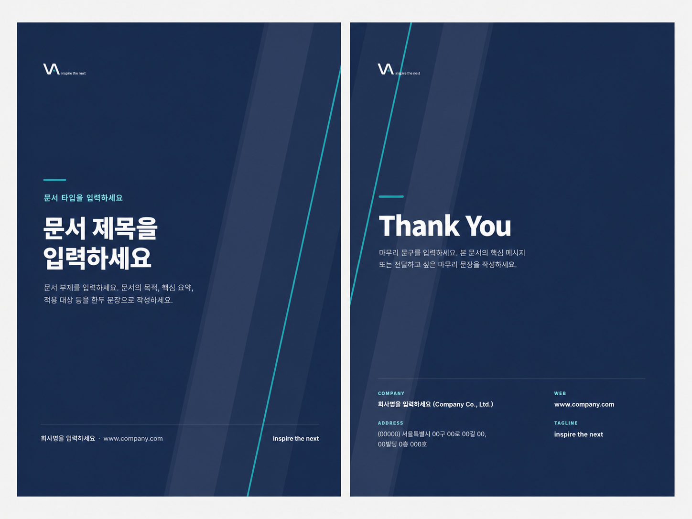

# VATOS Document Theme Guide

## 1. Purpose

본 문서는 VATOS 문서 작성 시 공통으로 적용할 **표지, 내지, 마무리 페이지의 기본 테마**를 정의한다.

VATOS의 모든 문서는 `DESIGN.md`의 공통 디자인 원칙을 기반으로 하되, 실제 문서 작성 시 별도 요청이 없는 때에는 본 문서의 기본 테마를 우선 적용한다.

본 가이드는 Word, PowerPoint, Excel, HTML, Markdown 문서에 공통으로 적용할 수 있는 시각적 기준을 제공하는 것을 목적으로 한다.

---

## 2. Theme Preview

본 테마는 아래 미리보기 이미지를 기준으로 한다.

- Preview image: `assets/theme/Theme-Urban-Navy.png`



표지, 내지, 마무리 페이지의 색상, 배치, 여백, 헤더/푸터 구성은 위 이미지를 참고하되, 문서 유형별 세부 구성은 각 문서 가이드의 규칙을 따른다.

---

## 3. Theme Concept

VATOS 문서 테마는 다음의 인상을 기준으로 한다.

- 도회적인
- 신뢰감 있는
- 전문적인
- 정돈된
- 기술 중심의
- 과하지 않은

문서의 전체 분위기는 **Urban Navy 기반의 표지와 밝은 내지 조합**을 기본으로 한다.

```text
Cover / Closing
→ Urban Navy background + White title + Cyan accent

Internal Page
→ Light surface + Navy accent + Thin border + Structured layout
```

---

## 4. Theme Usage Overview

| Document Area | Theme Usage | Design Rule |
| --- | --- | --- |
| Cover | Urban Navy 중심 | 네이비 배경, 흰색 타이틀, Cyan 포인트, 우측 사선 그래픽 |
| Internal | Light surface + Navy accent | 밝은 배경, 네이비 헤더/라인, 얇은 보더와 카드 구조 |
| Closing | Urban Navy 중심 | 표지와 동일한 톤, Thank You 문구, 회사 정보 배치 |
| Table / Card | Light surface | 얇은 보더, 충분한 여백, 정보 중심 구성 |
| Footer / Header | Minimal guide line | 옅은 회색 구분선, 좌측 문서 정보, 우측 페이지 번호 또는 슬로건 |

---

## 5. Cover Theme

표지는 문서의 첫인상을 결정하는 영역으로, VATOS의 전문성과 기술 중심 이미지를 전달해야 한다.

### 5.1 Layout

표지는 다음 요소로 구성한다.

```text
Logo
Document Type
Document Title
Subtitle
Footer Information
Decorative Diagonal Graphic
```

### 5.2 Cover Placeholder Text

표지 템플릿에는 실제 문구 대신 아래의 입력 가이드 문구를 사용한다.

```text
문서 타입을 입력하세요
예) 회사소개서 · 작업계획서 · 점검 리포트

문서 제목을 입력하세요

문서 부제를 입력하세요.
문서의 목적, 핵심 요약, 적용 대상 등을 한두 문장으로 작성하세요.
```

### 5.3 Cover Design Rules

- 배경은 Urban Navy 계열을 사용한다.
- 문서 제목은 White 계열로 크게 배치한다.
- 문서 타입 또는 보조 문구에는 Cyan 포인트 컬러를 사용한다.
- 우측 또는 좌측에는 사선 그래픽을 배치할 수 있다.
- 장식 요소는 최소화하고, 정보 전달을 방해하지 않아야 한다.
- 하단에는 회사명, 웹사이트, 슬로건을 배치한다.

### 5.4 Cover Footer Example

```text
주식회사 바토스 · VATOS Co., Ltd.        vatos.kr · inspire the next
```

---

## 6. Internal Page Theme

내지 페이지는 문서의 본문을 담는 영역이므로, 가독성과 정보 구조가 가장 중요하다.

### 6.1 Layout

내지 페이지는 다음 구성을 기본으로 한다.

```text
Header
Title / Section Title
Body Content
Table / Card / Figure
Footer
```

### 6.2 Header

본문 페이지 상단에는 문서 정보를 나타내는 머리말을 적용한다.

```text
좌측: VA + 문서 타입 또는 문서명
우측: VATOS · inspire the next
하단: 옅은 회색 구분선
```

예시:

```text
VA  COMPANY PROFILE                         VATOS · inspire the next
────────────────────────────────────────────────────────────
```

### 6.3 Footer

본문 페이지 하단에는 바닥글을 적용한다.

```text
좌측: 주식회사 바토스 · 문서명
우측: 페이지 번호
상단: 옅은 회색 구분선
```

예시:

```text
────────────────────────────────────────────────────────────
주식회사 바토스 · Company Profile 2026                    02
```

### 6.4 Internal Page Design Rules

- 배경은 White 또는 Light Surface를 사용한다.
- 제목은 Navy 계열로 강조한다.
- 섹션 구분에는 얇은 라인 또는 여백을 사용한다.
- 본문은 과도한 장식 없이 간결하게 구성한다.
- 표와 카드는 얇은 보더와 충분한 여백을 사용한다.
- 강조가 필요한 경우 Cyan 포인트를 제한적으로 사용한다.
- 한 페이지에 너무 많은 카드나 장식 요소를 넣지 않는다.

---

## 7. Closing Theme

마무리 페이지는 문서의 종료를 명확하게 전달하는 영역이다.

### 7.1 Layout

마무리 페이지는 다음 요소로 구성한다.

```text
Logo
Thank You
Closing Message
Company Information
Web / Tagline
Decorative Diagonal Graphic
```

### 7.2 Closing Placeholder Text

```text
Thank You

마무리 문구를 입력하세요.
본 문서의 핵심 메시지 또는 전달하고 싶은 마무리 문장을 작성하세요.
```

### 7.3 Closing Design Rules

- 표지와 동일한 Urban Navy 배경을 사용한다.
- Thank You 문구는 White 계열로 크게 배치한다.
- 마무리 문구는 한두 줄 이내로 작성한다.
- 하단에는 회사 정보, 주소, 웹사이트, 슬로건을 배치한다.
- 표지와 동일한 사선 그래픽을 사용하여 문서의 시작과 끝이 연결되도록 한다.

### 7.4 Closing Footer Example

```text
COMPANY
주식회사 바토스 (VATOS Co., Ltd.)

ADDRESS
(04778) 서울특별시 성동구 뚝섬로1길 63, 영창디지털타워 401-3호

WEB
www.vatos.co.kr

TAGLINE
inspire the next
```

---

## 8. Color Usage

VATOS 문서 테마는 아래 컬러 사용을 기본으로 한다.

| Role | Color Name | Usage |
| --- | --- | --- |
| Primary | Urban Navy | 표지 배경, 주요 헤더, 강조 영역 |
| Accent | Cyan | 포인트 라인, 섹션 라벨, 강조 요소 |
| Surface | White / Light Surface | 본문 배경, 카드 배경 |
| Text Primary | Dark Navy / Charcoal | 본문 제목, 주요 텍스트 |
| Text Secondary | Gray | 설명 문구, 보조 정보 |
| Border | Light Gray | 표, 카드, 헤더/푸터 구분선 |

### 8.1 Color Rules

- 표지와 마무리 페이지는 Urban Navy를 중심으로 구성한다.
- 내지 페이지는 밝은 배경을 기본으로 한다.
- Cyan은 강조용으로만 사용하고, 넓은 면적에 남용하지 않는다.
- 회색 라인은 구분선 용도로만 사용한다.
- 배경과 텍스트의 대비를 충분히 확보한다.

---

## 9. Typography Rules

문서 타이포그래피는 명확한 위계와 가독성을 우선한다.

### 9.1 Heading

- 문서 제목은 크고 명확하게 배치한다.
- 섹션 제목은 Navy 또는 Dark Navy 계열을 사용한다.
- 부제와 설명 문구는 본문보다 작고 가볍게 표현한다.

### 9.2 Body

- 본문은 읽기 쉬운 크기와 줄 간격을 유지한다.
- 긴 문장은 피하고, 문단을 짧게 나눈다.
- 표와 카드 안의 텍스트는 정렬 기준을 통일한다.

### 9.3 Alignment

| Content Type | Alignment |
| --- | --- |
| 제목 | Left |
| 본문 | Left |
| 긴 설명 | Left |
| 수치 | Right |
| 표 헤더 | Center |
| 짧은 상태값 | Center |

---

## 10. Table and Card Style

### 10.1 Table

표는 정보 전달을 목적으로 하며, 장식적인 요소를 최소화한다.

- 헤더는 밝은 배경 또는 Navy Accent를 사용한다.
- 행 간 구분선은 얇게 적용한다.
- 수치 값은 오른쪽 정렬한다.
- 설명이 긴 항목은 왼쪽 정렬한다.
- 표 안의 여백은 충분히 확보한다.

### 10.2 Card

카드는 핵심 정보 요약에 사용한다.

- 카드 배경은 White 또는 Light Surface를 사용한다.
- 보더는 얇게 적용한다.
- 그림자는 최소화한다.
- 한 페이지에 카드가 과도하게 많아지지 않도록 한다.
- 카드 안에는 하나의 메시지만 담는다.

---

## 11. Document Type Usage

문서 유형별 권장 사용 방식은 아래와 같다.

| Document Type | Cover | Internal Page | Closing | Note |
| --- | --- | --- | --- | --- |
| Company Profile | Required | Required | Required | 외부 공유 가능 문서는 검수 필요 |
| Proposal | Required | Required | Required | 고객사명, 프로젝트명 확인 |
| Work Plan | Required | Required | Optional | 작업 범위와 일정 중심 |
| Work Result | Required | Required | Optional | 결과와 증빙 중심 |
| Inspection Report | Optional | Required | Optional | 표와 수치 가독성 우선 |
| Tuning Report | Optional | Required | Optional | Before / After 비교 강조 |
| Internal Manual | Optional | Required | Optional | 검색성과 유지보수 우선 |
| Onboarding Guide | Optional | Required | Optional | 단계별 안내 중심 |

---

## 12. File and Example Usage

실제 문서 작성 시에는 아래 원칙을 따른다.

```text
1. 문서 유형에 맞는 예시 또는 템플릿을 선택한다.
2. 표지의 문서 타입, 제목, 부제를 수정한다.
3. 본문 페이지의 머리말과 바닥글 정보를 수정한다.
4. 본문은 문서 유형별 가이드에 맞춰 작성한다.
5. 마지막 장의 마무리 문구와 회사 정보를 확인한다.
6. PDF 또는 최종 배포본으로 변환하기 전 검수한다.
```

### 12.1 Current Example Files

현재 저장소의 `examples/` 폴더에 있는 예시 파일은 아래 경로를 사용한다.

```text
examples/ex_VATOS_Profile.pdf
examples/html_TABTYPE.html
examples/vatos-excel-template.xlsx
examples/vatos-word-template.docx
```

### 12.2 Default Theme Reference

별도 디자인 요청이 없는 경우, 문서 작성 시 아래 기본 테마를 우선 적용한다.

```text
assets/theme/Theme-Urban-Navy.png
```

---

## 13. Do

VATOS 문서 테마를 적용할 때 아래 원칙을 지킨다.

- 표지는 Urban Navy 기반으로 구성한다.
- 문서 제목은 명확하게 크게 배치한다.
- Cyan 포인트는 제한적으로 사용한다.
- 본문은 밝은 배경과 충분한 여백을 사용한다.
- 표와 카드는 얇은 보더 중심으로 구성한다.
- 머리말과 바닥글에는 문서 정보와 페이지 번호를 표시한다.
- 문서 유형에 맞는 템플릿 또는 예시 파일을 참고한다.
- 최종 배포 전 오탈자, 고객사명, 날짜, 버전을 확인한다.

---

## 14. Don’t

아래 표현은 사용하지 않는다.

- 과도한 그라데이션
- 과한 네온 효과
- 두꺼운 그림자
- 불필요한 3D 오브젝트
- 의미 없는 이모지 장식
- 지나치게 많은 카드 나열
- 본문 전체를 어두운 배경으로 구성
- 낮은 대비의 텍스트
- 고객사명, 수치, 정책의 임의 생성
- 표지와 내지의 톤이 완전히 다른 구성

---

## 15. Relationship with Other Guides

본 문서는 VATOS 문서 작성의 기본 테마를 정의한다.

문서 유형별 세부 규칙은 각 가이드를 따른다.

```text
DESIGN.md
→ VATOS 전체 디자인 원칙

specs/theme/document-theme-guide.md
→ 문서 작성 기본 테마

specs/word-base.md
→ Word 문서 세부 작성 규칙

specs/ppt-base.md
→ PowerPoint 문서 세부 작성 규칙
```

---

## 16. README Reference Text

`README.md`에는 아래 문구를 추가한다.

```markdown
VATOS 문서는 공통 디자인 시스템(`DESIGN.md`)을 기반으로 하되, 실제 문서 작성 시에는 `specs/theme/document-theme-guide.md`의 표지·내지·마무리 테마를 우선 적용합니다.
```

또는 미리보기 이미지와 예시 파일 위치까지 안내하려면 아래 문구를 함께 사용할 수 있다.

```markdown
문서 작성 기본 테마는 `specs/theme/document-theme-guide.md`를 참고하며, 미리보기 이미지는 `assets/theme/Theme-Urban-Navy.png`, 예시 파일은 `examples/` 폴더에서 확인할 수 있습니다.
```

---

## 17. Change Log

| Version | Date | Description |
| --- | --- | --- |
| alpha | 2026-07-14 | Initial document theme guide created |
